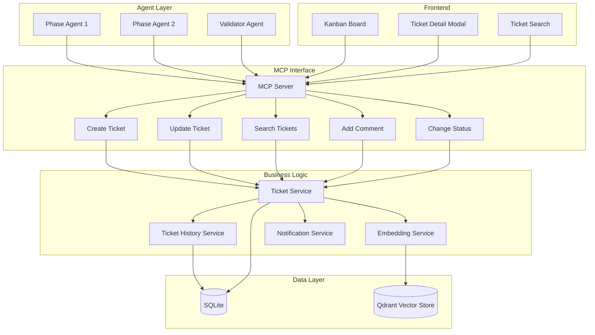
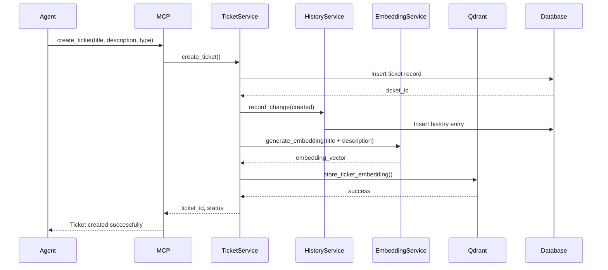
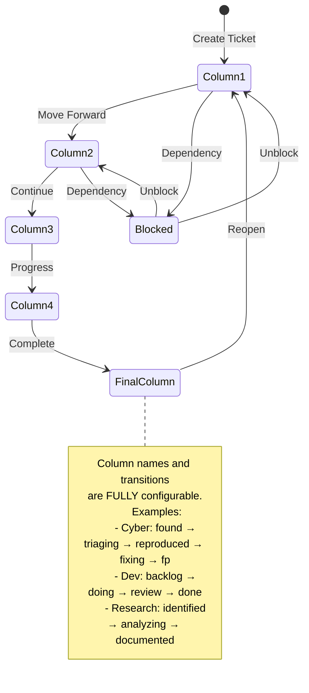
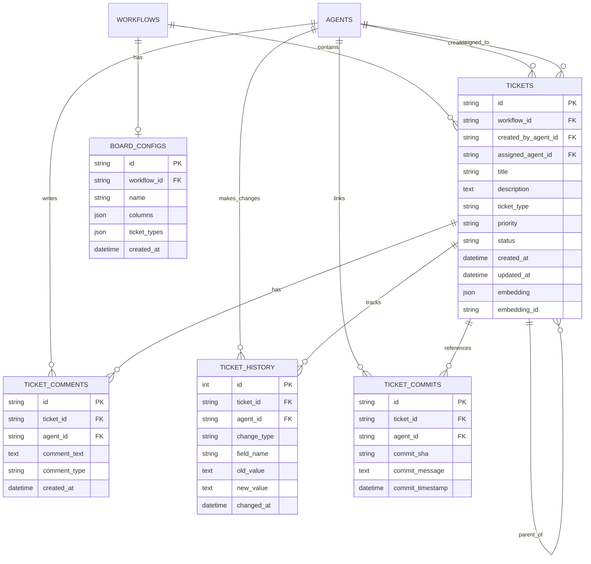

# Design Document: Ticket Tracking System

**Version:** 1.0
**Date:** 2025-10-20
**Status:** Design Phase
**Author:** System Design

---

## Table of Contents

1. [Executive Summary](#executive-summary)
2. [System Overview](#system-overview)
3. [Architecture & Components](#architecture--components)
4. [Database Schema](#database-schema)
5. [MCP Endpoints Specification](#mcp-endpoints-specification)
6. [SDK Integration](#sdk-integration)
7. [Frontend Design](#frontend-design)
8. [Semantic Search Integration](#semantic-search-integration)
9. [Workflow Integration](#workflow-integration)
10. [Implementation Considerations](#implementation-considerations)
11. [Implementation Notes](#implementation-notes)

---

## Executive Summary

The Ticket Tracking System introduces a Jira-like task management capability to Hephaestus, enabling agents to create, update, and manage tickets throughout workflow execution. This optional feature provides:

- **Agent-driven ticket management** with full CRUD operations
- **Configurable Kanban board** with customizable columns
- **Rich ticket metadata** including type, priority, history, and comments
- **Semantic search** using existing Qdrant infrastructure for intelligent ticket discovery
- **Human-friendly UI** with interactive Kanban board visualization
- **Optional activation** via HephaestusSDK configuration

This system complements existing task management by providing a more granular, flexible tracking mechanism suitable for complex multi-agent workflows where agents need to coordinate through ticket-based communication.

---

## System Overview

### Purpose & Goals

The Ticket Tracking System serves as a collaborative workspace where:

1. **Agents can self-organize** by creating tickets for work items they discover
2. **Work becomes visible** through a centralized tracking interface
3. **Context is preserved** via comments, history, and commit tracking
4. **Discovery is enhanced** through semantic search across all ticket content
5. **Humans can observe and intervene** through the interactive Kanban UI

### Key Design Principles

1. **Optional by Default**: Should not impact existing workflows unless explicitly enabled
2. **Agent-First**: Designed primarily for agent interaction, with human UI as secondary
3. **Flexible Configuration**: Board columns and ticket types should be customizable per workflow
4. **RAG-Powered Discovery**: Leverage existing Qdrant infrastructure for intelligent search
5. **Audit Trail**: Complete history of all ticket changes and related commits

### High-Level Architecture



---

## Architecture & Components

### Core Components

#### 1. Ticket Service (`src/services/ticket_service.py`)

**Responsibilities:**
- CRUD operations for tickets
- Status transitions and validation
- Ticket lifecycle management
- Integration with history tracking

**Key Methods:**
```python
class TicketService:
    async def create_ticket(workflow_id, agent_id, title, description, ticket_type, priority, initial_status)
    async def update_ticket(ticket_id, agent_id, updates)
    async def change_status(ticket_id, agent_id, new_status, comment)
    async def add_comment(ticket_id, agent_id, comment_text)
    async def get_ticket(ticket_id)
    async def get_tickets_by_workflow(workflow_id, filters)
    async def get_tickets_by_status(workflow_id, status)
    async def assign_ticket(ticket_id, agent_id)
```

#### 2. Ticket History Service (`src/services/ticket_history_service.py`)

**Responsibilities:**
- Track all ticket state changes
- Record field modifications
- Link commits to tickets
- Provide audit trail

**Key Methods:**
```python
class TicketHistoryService:
    async def record_change(ticket_id, agent_id, change_type, old_value, new_value, metadata)
    async def record_status_transition(ticket_id, agent_id, from_status, to_status)
    async def link_commit(ticket_id, commit_sha, message)
    async def get_ticket_history(ticket_id)
    async def get_ticket_timeline(ticket_id)
```

#### 3. Ticket Search Service (`src/services/ticket_search_service.py`)

**Responsibilities:**
- Semantic search using Qdrant
- Keyword-based filtering
- Advanced query support
- Result ranking and relevance

**Key Methods:**
```python
class TicketSearchService:
    async def semantic_search(query_text, workflow_id, limit, filters)
    async def search_by_keywords(keywords, workflow_id, filters)
    async def find_related_tickets(ticket_id, limit)
    async def index_ticket(ticket_id, title, description, comments)
    async def reindex_ticket(ticket_id)
```

### Component Interaction Flow



### Status Transition Flow

**IMPORTANT:** All statuses are fully configurable via the board_config. The workflow designer defines which columns exist and what transitions are allowed. There are no hardcoded status values.



---

## Database Schema

### New Tables

#### `tickets` Table

Stores core ticket information.

```sql
CREATE TABLE tickets (
    id VARCHAR PRIMARY KEY,                    -- Format: ticket-{uuid}
    workflow_id VARCHAR NOT NULL,              -- FK to workflows
    created_by_agent_id VARCHAR NOT NULL,      -- FK to agents
    assigned_agent_id VARCHAR,                 -- FK to agents (nullable)

    -- Core Fields
    title VARCHAR(500) NOT NULL,
    description TEXT NOT NULL,
    ticket_type VARCHAR(50) NOT NULL,          -- bug, feature, improvement, task, spike, etc.
    priority VARCHAR(20) NOT NULL,             -- low, medium, high, critical
    status VARCHAR(50) NOT NULL,               -- Based on board_config columns (fully configurable)

    -- Metadata
    created_at DATETIME NOT NULL DEFAULT CURRENT_TIMESTAMP,
    updated_at DATETIME NOT NULL DEFAULT CURRENT_TIMESTAMP,
    started_at DATETIME,                       -- When work begins (configurable trigger)
    completed_at DATETIME,                     -- When marked complete (configurable)

    -- Links & References
    parent_ticket_id VARCHAR,                  -- FK to tickets (for sub-tickets)
    related_task_ids JSON,                     -- List of related task IDs
    related_ticket_ids JSON,                   -- List of related ticket IDs for context
    tags JSON,                                 -- List of tags

    -- Search & Discovery
    embedding JSON,                            -- Cached embedding for quick access
    embedding_id VARCHAR,                      -- Reference to Qdrant

    -- Blocking & Dependencies
    blocked_by_ticket_ids JSON,                -- List of ticket IDs blocking this ticket
    is_resolved BOOLEAN DEFAULT FALSE,         -- Whether this ticket is resolved
    resolved_at DATETIME,                      -- When ticket was resolved

    FOREIGN KEY (workflow_id) REFERENCES workflows(id),
    FOREIGN KEY (created_by_agent_id) REFERENCES agents(id),
    FOREIGN KEY (assigned_agent_id) REFERENCES agents(id),
    FOREIGN KEY (parent_ticket_id) REFERENCES tickets(id)
);

CREATE INDEX idx_tickets_workflow ON tickets(workflow_id);
CREATE INDEX idx_tickets_status ON tickets(status);
CREATE INDEX idx_tickets_assigned_agent ON tickets(assigned_agent_id);
CREATE INDEX idx_tickets_type ON tickets(ticket_type);
CREATE INDEX idx_tickets_priority ON tickets(priority);
CREATE INDEX idx_tickets_created_at ON tickets(created_at);
CREATE INDEX idx_tickets_is_resolved ON tickets(is_resolved);
CREATE INDEX idx_tickets_workflow_status ON tickets(workflow_id, status);
```

#### `ticket_comments` Table

Stores comments and discussions on tickets.

```sql
CREATE TABLE ticket_comments (
    id VARCHAR PRIMARY KEY,                    -- Format: comment-{uuid}
    ticket_id VARCHAR NOT NULL,                -- FK to tickets
    agent_id VARCHAR NOT NULL,                 -- FK to agents

    -- Content
    comment_text TEXT NOT NULL,
    comment_type VARCHAR(50) DEFAULT 'general', -- general, status_change, assignment, blocker, resolution

    -- Metadata
    created_at DATETIME NOT NULL DEFAULT CURRENT_TIMESTAMP,
    updated_at DATETIME,                       -- If edited
    is_edited BOOLEAN DEFAULT FALSE,

    -- Rich Content
    mentions JSON,                             -- List of mentioned agent/ticket IDs
    attachments JSON,                          -- List of file paths or URLs

    FOREIGN KEY (ticket_id) REFERENCES tickets(id) ON DELETE CASCADE,
    FOREIGN KEY (agent_id) REFERENCES agents(id)
);

CREATE INDEX idx_comments_ticket ON ticket_comments(ticket_id);
CREATE INDEX idx_comments_agent ON ticket_comments(agent_id);
CREATE INDEX idx_comments_created_at ON ticket_comments(created_at);
```

#### `ticket_history` Table

Tracks all changes to tickets for audit trail.

```sql
CREATE TABLE ticket_history (
    id INTEGER PRIMARY KEY AUTOINCREMENT,
    ticket_id VARCHAR NOT NULL,                -- FK to tickets
    agent_id VARCHAR NOT NULL,                 -- FK to agents (who made the change)

    -- Change Information
    change_type VARCHAR(50) NOT NULL,          -- created, status_changed, assigned, commented,
                                              -- field_updated, commit_linked, reopened, blocked, unblocked
    field_name VARCHAR(100),                   -- Which field changed (if applicable)
    old_value TEXT,                           -- Previous value (JSON for complex types)
    new_value TEXT,                           -- New value (JSON for complex types)

    -- Context
    change_description TEXT,                   -- Human-readable description
    metadata JSON,                            -- Additional context (e.g., commit info, file paths)

    -- Timing
    changed_at DATETIME NOT NULL DEFAULT CURRENT_TIMESTAMP,

    FOREIGN KEY (ticket_id) REFERENCES tickets(id) ON DELETE CASCADE,
    FOREIGN KEY (agent_id) REFERENCES agents(id)
);

CREATE INDEX idx_history_ticket ON ticket_history(ticket_id);
CREATE INDEX idx_history_change_type ON ticket_history(change_type);
CREATE INDEX idx_history_changed_at ON ticket_history(changed_at);
```

#### `ticket_commits` Table

Links git commits to tickets for traceability.

```sql
CREATE TABLE ticket_commits (
    id VARCHAR PRIMARY KEY,                    -- Format: tc-{uuid}
    ticket_id VARCHAR NOT NULL,                -- FK to tickets
    agent_id VARCHAR NOT NULL,                 -- FK to agents

    -- Commit Information
    commit_sha VARCHAR(40) NOT NULL,
    commit_message TEXT NOT NULL,
    commit_timestamp DATETIME NOT NULL,

    -- Change Stats
    files_changed INTEGER,
    insertions INTEGER,
    deletions INTEGER,
    files_list JSON,                          -- List of changed file paths

    -- Linking
    linked_at DATETIME NOT NULL DEFAULT CURRENT_TIMESTAMP,
    link_method VARCHAR(50) DEFAULT 'manual',  -- manual, auto_detected, worktree

    FOREIGN KEY (ticket_id) REFERENCES tickets(id) ON DELETE CASCADE,
    FOREIGN KEY (agent_id) REFERENCES agents(id)
);

CREATE INDEX idx_commits_ticket ON ticket_commits(ticket_id);
CREATE INDEX idx_commits_commit_sha ON ticket_commits(commit_sha);
CREATE UNIQUE INDEX idx_unique_ticket_commit ON ticket_commits(ticket_id, commit_sha);
```

#### `board_configs` Table

Stores Kanban board configurations per workflow.

```sql
CREATE TABLE board_configs (
    id VARCHAR PRIMARY KEY,                    -- Format: board-{uuid}
    workflow_id VARCHAR UNIQUE NOT NULL,       -- FK to workflows

    -- Board Configuration
    name VARCHAR(200) NOT NULL,
    columns JSON NOT NULL,                     -- Array of {id, name, order, color}
    ticket_types JSON NOT NULL,                -- Array of allowed ticket types
    default_ticket_type VARCHAR(50),
    initial_status VARCHAR(50) NOT NULL,       -- Default status for new tickets

    -- Settings
    auto_assign BOOLEAN DEFAULT FALSE,
    require_comments_on_status_change BOOLEAN DEFAULT FALSE,
    allow_reopen BOOLEAN DEFAULT TRUE,
    track_time BOOLEAN DEFAULT FALSE,

    -- Metadata
    created_at DATETIME NOT NULL DEFAULT CURRENT_TIMESTAMP,
    updated_at DATETIME NOT NULL DEFAULT CURRENT_TIMESTAMP,

    FOREIGN KEY (workflow_id) REFERENCES workflows(id) ON DELETE CASCADE
);
```

**Example `columns` JSON (fully configurable by workflow):**
```json
[
    {"id": "backlog", "name": "Backlog", "order": 0, "color": "#9ca3af"},
    {"id": "todo", "name": "To Do", "order": 1, "color": "#6b7280"},
    {"id": "in_progress", "name": "In Progress", "order": 2, "color": "#3b82f6"},
    {"id": "review", "name": "Review", "order": 3, "color": "#f59e0b"},
    {"id": "done", "name": "Done", "order": 4, "color": "#10b981"}
]
```

**Example for Cybersecurity Workflow:**
```json
[
    {"id": "found", "name": "Found", "order": 0, "color": "#ef4444"},
    {"id": "triaging", "name": "Triaging", "order": 1, "color": "#f59e0b"},
    {"id": "reproduced", "name": "Reproduced", "order": 2, "color": "#3b82f6"},
    {"id": "fixing", "name": "Fixing", "order": 3, "color": "#8b5cf6"},
    {"id": "fp", "name": "False Positive", "order": 4, "color": "#6b7280"},
    {"id": "fixed", "name": "Fixed", "order": 5, "color": "#10b981"}
]
```

### Schema Relationships Diagram



---

## MCP Endpoints Specification

### Endpoint Overview

All ticket-related endpoints follow the pattern: `/tickets/*` and require agent authentication.

### 1. Create Ticket

**Endpoint:** `POST /tickets/create`

**Purpose:** Allow agents to create new tickets in the workflow.

**Request Model:**
```python
class CreateTicketRequest(BaseModel):
    workflow_id: str
    agent_id: str
    title: str = Field(..., min_length=3, max_length=500)
    description: str = Field(..., min_length=10)
    ticket_type: str = Field(default="task")  # bug, feature, improvement, task, spike
    priority: str = Field(default="medium", pattern="^(low|medium|high|critical)$")
    initial_status: Optional[str] = None      # If None, uses board_config.initial_status
    assigned_agent_id: Optional[str] = None
    parent_ticket_id: Optional[str] = None
    blocked_by_ticket_ids: List[str] = Field(default_factory=list)  # Tickets blocking this one
    tags: List[str] = Field(default_factory=list)
    related_task_ids: List[str] = Field(default_factory=list)
```

**Response Model:**
```python
class CreateTicketResponse(BaseModel):
    success: bool
    ticket_id: str
    status: str
    message: str
    embedding_created: bool
    similar_tickets: List[Dict[str, Any]]  # Related tickets found via semantic search
```

**MCP Tool Definition:**
```python
{
    "name": "mcp__hephaestus__create_ticket",
    "description": "Create a new ticket in the workflow tracking system. Use this when you discover work that needs to be tracked separately from tasks.",
    "parameters": {
        "workflow_id": "ID of the workflow this ticket belongs to",
        "agent_id": "Your agent ID",
        "title": "Short, descriptive title for the ticket",
        "description": "Detailed description of what needs to be done",
        "ticket_type": "Type of ticket (bug/feature/improvement/task/spike)",
        "priority": "Priority level (low/medium/high/critical)",
        "tags": "Optional list of tags for categorization"
    }
}
```

**Business Logic:**
1. Validate workflow exists and is active
2. Validate board_config exists for workflow
3. Validate ticket_type is allowed by board_config
4. If initial_status is None, use board_config.initial_status
5. Validate all blocked_by_ticket_ids exist and belong to same workflow
6. Create ticket record with unique ID
7. Generate embedding from title + description
8. Store embedding in Qdrant with metadata
9. Find semantically similar tickets (check for potential duplicates)
10. Record creation in ticket_history
11. Return ticket info with similar tickets for context

---

### 2. Update Ticket

**Endpoint:** `POST /tickets/update`

**Purpose:** Update ticket fields (excluding status changes).

**Request Model:**
```python
class UpdateTicketRequest(BaseModel):
    ticket_id: str
    agent_id: str
    updates: Dict[str, Any] = Field(..., description="Fields to update")
    update_comment: Optional[str] = Field(None, description="Optional comment explaining changes")
```

**Allowed update fields:**
- `title`
- `description`
- `priority`
- `assigned_agent_id`
- `ticket_type`
- `tags`
- `blocked_by_ticket_ids` (list of ticket IDs)

**Response Model:**
```python
class UpdateTicketResponse(BaseModel):
    success: bool
    ticket_id: str
    fields_updated: List[str]
    message: str
    embedding_updated: bool
```

**Business Logic:**
1. Validate ticket exists
2. Validate agent has permission
3. For each field update:
   - Record old value
   - Update field
   - Create history entry
4. If title/description changed, regenerate embedding
5. If update_comment provided, create comment
6. Return summary of changes

---

### 3. Change Ticket Status

**Endpoint:** `POST /tickets/change-status`

**Purpose:** Move ticket to a different status column.

**Request Model:**
```python
class ChangeTicketStatusRequest(BaseModel):
    ticket_id: str
    agent_id: str
    new_status: str
    comment: str = Field(..., min_length=10, description="Required comment explaining status change")
    commit_sha: Optional[str] = Field(None, description="Optional commit SHA to link")
```

**Response Model:**
```python
class ChangeTicketStatusResponse(BaseModel):
    success: bool
    ticket_id: str
    old_status: str
    new_status: str
    message: str
    blocked: bool = False                    # True if ticket is blocked
    blocking_ticket_ids: List[str] = []      # IDs of tickets blocking this one
```

**Business Logic:**
1. Validate ticket exists and new_status is valid per board_config
2. **Check if ticket is blocked** - If blocked_by_ticket_ids is not empty, prevent status change and return error
3. Update ticket status
4. Update timing fields (started_at, completed_at based on config)
5. Create status change comment automatically
6. Record in ticket_history
7. If commit_sha provided, link commit
8. Trigger notifications if needed

**Note:** Blocked tickets cannot have their status changed until all blocking tickets are resolved.

---

### 4. Add Comment

**Endpoint:** `POST /tickets/comment`

**Purpose:** Add a comment to a ticket.

**Request Model:**
```python
class AddCommentRequest(BaseModel):
    ticket_id: str
    agent_id: str
    comment_text: str = Field(..., min_length=1)
    comment_type: str = Field(default="general")  # general, status_change, blocker, resolution
    mentions: List[str] = Field(default_factory=list)  # Agent/ticket IDs mentioned
    attachments: List[str] = Field(default_factory=list)  # File paths
```

**Response Model:**
```python
class AddCommentResponse(BaseModel):
    success: bool
    comment_id: str
    ticket_id: str
    message: str
```

**Business Logic:**
1. Validate ticket exists
2. Create comment record
3. Parse mentions and notify mentioned agents
4. Record in ticket_history
5. Optionally update ticket embedding if comment is substantial

---

### 5. Search Tickets

**Endpoint:** `POST /tickets/search`

**Purpose:** Semantic and keyword search across tickets.

**Request Model:**
```python
class SearchTicketsRequest(BaseModel):
    workflow_id: str
    agent_id: str
    query: str = Field(..., min_length=3, description="Search query (natural language)")
    search_type: str = Field(default="hybrid", pattern="^(semantic|keyword|hybrid)$")  # Default to hybrid!
    filters: Optional[Dict[str, Any]] = Field(default_factory=dict)
    limit: int = Field(default=10, ge=1, le=50)
    include_comments: bool = Field(default=True, description="Search in comments too")
```

**Filters structure:**
```python
{
    "status": ["todo", "in_progress"],  # List of statuses
    "priority": ["high", "critical"],    # List of priorities
    "ticket_type": ["bug", "feature"],   # List of types
    "assigned_agent_id": "agent-123",    # Specific agent
    "tags": ["frontend", "api"],         # Tags to match
    "created_after": "2025-10-01",       # Date filters
    "is_blocked": false
}
```

**Response Model:**
```python
class SearchTicketsResponse(BaseModel):
    success: bool
    query: str
    results: List[TicketSearchResult]
    total_found: int
    search_time_ms: float

class TicketSearchResult(BaseModel):
    ticket_id: str
    title: str
    description: str
    status: str
    priority: str
    ticket_type: str
    relevance_score: float  # 0-1 similarity score
    matched_in: List[str]   # ["title", "description", "comments"]
    preview: str           # Snippet showing match context
    created_at: str
    assigned_agent_id: Optional[str]
```

**Business Logic (Hybrid Mode - Default):**
1. **Semantic Search (70% weight)**:
   - Generate embedding for query using configured model
   - Execute Qdrant vector search with filters
   - Get top results with similarity scores

2. **Keyword Search (30% weight)**:
   - Execute SQLite FTS5 full-text search
   - Match on title, description, comments
   - Get top results with rank scores

3. **Merge & Re-rank**:
   - Combine results using Reciprocal Rank Fusion (RRF)
   - Weight: semantic results * 0.7 + keyword results * 0.3
   - Sort by combined score
   - Remove duplicates

4. Generate preview snippets showing match context
5. Return formatted results with relevance scores

---

### 6. Get Tickets

**Endpoint:** `GET /tickets/get`

**Purpose:** Retrieve tickets with filtering and pagination.

**Query Parameters:**
```python
class GetTicketsRequest(BaseModel):
    workflow_id: str
    agent_id: str
    status: Optional[str] = None           # Filter by status
    ticket_type: Optional[str] = None      # Filter by type
    priority: Optional[str] = None         # Filter by priority
    assigned_agent_id: Optional[str] = None
    include_completed: bool = True
    limit: int = Field(default=50, ge=1, le=200)
    offset: int = Field(default=0, ge=0)
    sort_by: str = Field(default="created_at", pattern="^(created_at|updated_at|priority|status)$")
    sort_order: str = Field(default="desc", pattern="^(asc|desc)$")
```

**Response Model:**
```python
class GetTicketsResponse(BaseModel):
    success: bool
    tickets: List[TicketDetail]
    total_count: int
    has_more: bool

class TicketDetail(BaseModel):
    ticket_id: str
    workflow_id: str
    title: str
    description: str
    ticket_type: str
    priority: str
    status: str
    created_by_agent_id: str
    assigned_agent_id: Optional[str]
    created_at: str
    updated_at: str
    started_at: Optional[str]
    completed_at: Optional[str]
    tags: List[str]
    comment_count: int
    commit_count: int
    is_blocked: bool
    blocked_by_ticket_ids: List[str]
```

---

### 7. Get Ticket Details

**Endpoint:** `GET /tickets/{ticket_id}`

**Purpose:** Get full ticket information including comments and history.

**Response Model:**
```python
class TicketFullDetail(BaseModel):
    # All fields from TicketDetail plus:
    comments: List[CommentDetail]
    history: List[HistoryEntry]
    commits: List[CommitDetail]
    related_tickets: List[RelatedTicketInfo]
    related_tasks: List[RelatedTaskInfo]
    parent_ticket: Optional[TicketDetail]
    sub_tickets: List[TicketDetail]

class CommentDetail(BaseModel):
    comment_id: str
    agent_id: str
    comment_text: str
    comment_type: str
    created_at: str
    mentions: List[str]

class HistoryEntry(BaseModel):
    change_type: str
    field_name: Optional[str]
    old_value: Optional[str]
    new_value: Optional[str]
    change_description: str
    changed_at: str
    agent_id: str

class CommitDetail(BaseModel):
    commit_sha: str
    commit_message: str
    commit_timestamp: str
    files_changed: int
    insertions: int
    deletions: int
    files_list: List[str]  # List of changed file paths
    agent_id: str
```

---

### 8. Get Board Configuration

**Endpoint:** `GET /tickets/board-config/{workflow_id}`

**Purpose:** Retrieve Kanban board configuration for a workflow.

**Response Model:**
```python
class BoardConfigResponse(BaseModel):
    success: bool
    board_config: BoardConfig

class BoardConfig(BaseModel):
    board_id: str
    workflow_id: str
    name: str
    columns: List[ColumnConfig]
    ticket_types: List[TicketType]
    default_ticket_type: str
    settings: BoardSettings

class ColumnConfig(BaseModel):
    id: str
    name: str
    order: int
    wip_limit: Optional[int]
    color: str
    ticket_count: int  # Current count in this column

class TicketType(BaseModel):
    id: str
    name: str
    icon: str
    color: str

class BoardSettings(BaseModel):
    auto_assign: bool
    require_comments_on_status_change: bool
    allow_reopen: bool
    track_time: bool
```

---

### 9. Link Commit to Ticket

**Endpoint:** `POST /tickets/link-commit`

**Purpose:** Manually link a git commit to a ticket.

**Request Model:**
```python
class LinkCommitRequest(BaseModel):
    ticket_id: str
    agent_id: str
    commit_sha: str
    commit_message: Optional[str] = None  # Auto-fetched if not provided
```

**Response Model:**
```python
class LinkCommitResponse(BaseModel):
    success: bool
    ticket_id: str
    commit_sha: str
    message: str
```

---

### 10. Get Ticket Statistics

**Endpoint:** `GET /tickets/stats/{workflow_id}`

**Purpose:** Retrieve aggregate statistics for workflow tickets.

**Response Model:**
```python
class TicketStatsResponse(BaseModel):
    success: bool
    workflow_id: str
    stats: TicketStats

class TicketStats(BaseModel):
    total_tickets: int
    by_status: Dict[str, int]           # {"backlog": 5, "in_progress": 3, ...}
    by_type: Dict[str, int]             # {"bug": 8, "feature": 12, ...}
    by_priority: Dict[str, int]         # {"high": 4, "medium": 10, ...}
    by_agent: Dict[str, int]            # {"agent-1": 5, "agent-2": 3, ...}
    blocked_count: int
    resolved_count: int
    avg_comments_per_ticket: float
    avg_commits_per_ticket: float
    created_today: int
    completed_today: int
    velocity_last_7_days: int           # Tickets completed in last 7 days
```

---

### 11. Resolve Ticket

**Endpoint:** `POST /tickets/resolve`

**Purpose:** Mark a ticket as resolved and automatically unblock dependent tickets.

**Request Model:**
```python
class ResolveTicketRequest(BaseModel):
    ticket_id: str
    agent_id: str
    resolution_comment: str = Field(..., min_length=10, description="Comment explaining resolution")
    commit_sha: Optional[str] = Field(None, description="Commit that resolved the ticket")
```

**Response Model:**
```python
class ResolveTicketResponse(BaseModel):
    success: bool
    ticket_id: str
    message: str
    unblocked_tickets: List[str]  # List of ticket IDs that were unblocked
```

**Business Logic:**
1. Validate ticket exists
2. Set `is_resolved = True` and `resolved_at = now()`
3. Add resolution comment
4. If commit_sha provided, link commit
5. **Find all tickets blocked by this ticket** (WHERE JSON_CONTAINS(blocked_by_ticket_ids, ticket_id))
6. **Remove this ticket_id from their blocked_by_ticket_ids**
7. For each unblocked ticket, add comment: "Unblocked - {this_ticket_id} was resolved"
8. Record in history
9. Return list of unblocked ticket IDs

**Note:** Resolving a ticket cascades to unblock all dependent tickets automatically.

---

### 12. Get Commit Diff

**Endpoint:** `GET /tickets/commit-diff/{commit_sha}`

**Purpose:** Retrieve detailed git diff for a commit (used by Git Diff Window).

**Response Model:**
```python
class CommitDiffResponse(BaseModel):
    success: bool
    commit_sha: str
    message: str
    author_agent_id: str
    timestamp: str
    files_changed: int
    insertions: int
    deletions: int
    files: List[FileDiff]

class FileDiff(BaseModel):
    path: str
    status: str  # modified, added, deleted, renamed
    insertions: int
    deletions: int
    diff: str    # Unified diff content
    language: str  # For syntax highlighting (python, javascript, etc.)
    old_path: Optional[str]  # For renamed files
```

**Business Logic:**
1. Validate commit exists in worktree_commits or git history
2. Execute `git show {commit_sha}` to get commit details
3. Parse commit message, author (agent), timestamp
4. Execute `git diff {commit_sha}^ {commit_sha}` for unified diff
5. Parse diff output to extract:
   - File paths and status (added/modified/deleted)
   - Line changes per file (+lines, -lines)
   - Unified diff content per file
6. Detect language from file extension for syntax highlighting
7. Return structured diff data

**Git Commands Used:**
```bash
# Get commit metadata
git show --format="%H|%an|%at|%s" -s {commit_sha}

# Get file stats
git diff --numstat {commit_sha}^ {commit_sha}

# Get unified diff per file
git diff {commit_sha}^ {commit_sha} -- {file_path}
```

---

## SDK Integration

### Configuration in HephaestusSDK

The ticket tracking system is enabled via SDK configuration:

```python
from hephaestus import HephaestusSDK, TicketBoardConfig, ColumnConfig, TicketTypeConfig

# Define board configuration (fully customizable)
board_config = TicketBoardConfig(
    name="Development Board",
    columns=[
        ColumnConfig(id="backlog", name="Backlog", order=0, color="#9ca3af"),
        ColumnConfig(id="todo", name="To Do", order=1, color="#6b7280"),
        ColumnConfig(id="in_progress", name="In Progress", order=2, color="#3b82f6"),
        ColumnConfig(id="review", name="Code Review", order=3, color="#f59e0b"),
        ColumnConfig(id="testing", name="Testing", order=4, color="#8b5cf6"),
        ColumnConfig(id="done", name="Done", order=5, color="#10b981")
    ],
    initial_status="backlog",  # Default status for new tickets

    ticket_types=[
        TicketTypeConfig(id="bug", name="Bug", icon="🐛", color="#ef4444"),
        TicketTypeConfig(id="feature", name="Feature", icon="✨", color="#3b82f6"),
        TicketTypeConfig(id="improvement", name="Improvement", icon="📈", color="#10b981"),
        TicketTypeConfig(id="task", name="Task", icon="📋", color="#6b7280"),
        TicketTypeConfig(id="spike", name="Spike", icon="🔬", color="#8b5cf6"),
    ],
    default_ticket_type="task",
    settings={
        "auto_assign": False,
        "require_comments_on_status_change": True,
        "allow_reopen": True,
        "track_time": True
    }
)

# Initialize SDK with ticket tracking enabled
sdk = HephaestusSDK(
    workflow_name="My Workflow",
    phases_folder="./phases",
    ticket_tracking_enabled=True,          # Enable the feature
    ticket_board_config=board_config       # Provide board configuration
)

# Run workflow
sdk.run()
```

### SDK Methods

```python
class HephaestusSDK:
    def enable_ticket_tracking(self, board_config: TicketBoardConfig):
        """Enable ticket tracking for this workflow."""

    def disable_ticket_tracking(self):
        """Disable ticket tracking for this workflow."""

    def get_tickets(self, filters: Optional[Dict] = None) -> List[Ticket]:
        """Retrieve tickets with optional filtering."""

    def get_ticket_stats(self) -> TicketStats:
        """Get aggregate statistics for workflow tickets."""

    def export_tickets(self, format: str = "json") -> str:
        """Export all tickets to JSON/CSV/Markdown."""
```

### Agent Prompt Injection

When ticket tracking is enabled, agents receive additional context in their system prompt:

```python
TICKET_TRACKING_PROMPT = """
## Ticket Tracking System

This workflow has ticket tracking enabled. You MUST work within the ticket system.

**YOUR TICKET ID: {ticket_id}**

All your work should be tracked under this ticket. When you complete your task, the ticket will be automatically updated and resolved.

**Available Tools:**
- `mcp__hephaestus__create_ticket` - Create a new ticket
- `mcp__hephaestus__update_ticket` - Update ticket fields
- `mcp__hephaestus__change_ticket_status` - Move ticket to different status
- `mcp__hephaestus__add_ticket_comment` - Add comment to ticket
- `mcp__hephaestus__search_tickets` - Search for relevant tickets (uses RAG/embeddings)
- `mcp__hephaestus__get_tickets` - List tickets with filters
- `mcp__hephaestus__link_commit` - Link your commits to tickets
- `mcp__hephaestus__resolve_ticket` - Mark ticket as resolved (auto-unblocks dependent tickets)

**Board Configuration:**
Status columns: {column_names}
Ticket types: {ticket_types}
Initial status: {initial_status}

**Blocking/Dependencies:**
- If you create a ticket that depends on another, use `blocked_by_ticket_ids`
- Blocked tickets cannot change status until blocking tickets are resolved
- When you resolve a ticket, all tickets blocked by it are automatically unblocked

**When to Create Tickets:**
- When you discover a bug or issue that needs addressing
- When you identify a potential improvement or optimization
- When you need to track a specific piece of work separately from your main task
- When you want to communicate work items to other agents

**Best Practices:**
- Search for existing tickets before creating new ones (use semantic search!)
- Use descriptive titles and detailed descriptions
- Add comments when you make progress or encounter blockers
- Link commits to tickets for traceability (happens automatically on task completion)
- Update ticket status as you work through the board columns
- Add relevant tags for categorization
- Use blocked_by_ticket_ids for dependencies
"""
```

---

## Frontend Design

### New Route & Page

**Route:** `/tickets`

**Component:** `frontend/src/pages/Tickets.tsx`

### UI Layout

```
┌─────────────────────────────────────────────────────────────┐
│  Hephaestus - Ticket Tracking                               │
├─────────────────────────────────────────────────────────────┤
│  [Search: _______________________________] [+ New Ticket]   │
│  Filters: [All Types ▾] [All Priorities ▾] [All Agents ▾]  │
├─────────────────────────────────────────────────────────────┤
│  ┌─────────┐ ┌─────────┐ ┌─────────┐ ┌─────────┐ ┌───────┐│
│  │ Backlog │ │  To Do  │ │In Progr.│ │ Review  │ │ Done  ││
│  │   (12)  │ │   (8)   │ │  (3/5)  │ │  (2/3)  │ │  (45) ││
│  ├─────────┤ ├─────────┤ ├─────────┤ ├─────────┤ ├───────┤│
│  │┌───────┐│ │┌───────┐│ │┌───────┐│ │┌───────┐│ │┌─────┐││
│  ││ TKT-1 ││ ││ TKT-5 ││ ││ TKT-9 ││ ││TKT-12 ││ ││TKT..││
│  ││ 🐛 Bug││ ││✨Feat ││ ││📋Task ││ ││✨Feat ││ │└─────┘││
│  ││ HIGH  ││ ││ MED   ││ ││ HIGH  ││ ││ MED   ││ │       ││
│  │└───────┘│ │└───────┘│ │└───────┘│ │└───────┘│ │       ││
│  │         │ │         │ │         │ │         │ │       ││
│  │┌───────┐│ │┌───────┐│ │┌───────┐│ │         │ │       ││
│  ││ TKT-2 ││ ││ TKT-6 ││ ││ TKT-10││ │         │ │       ││
│  │└───────┘│ │└───────┘│ │└───────┘│ │         │ │       ││
│  └─────────┘ └─────────┘ └─────────┘ └─────────┘ └───────┘│
└─────────────────────────────────────────────────────────────┘
```

### Kanban Board Component

**Component:** `frontend/src/components/tickets/KanbanBoard.tsx`

**Features:**
- Drag-and-drop ticket movement between columns
- WIP limit indicators (visual warnings when exceeded)
- Real-time updates via WebSocket
- Filtering and search integration
- Responsive grid layout
- Column collapsing for focus

**Tech Stack:**
- `@dnd-kit/core` for drag-and-drop
- `react-query` for data fetching
- `WebSocket` for real-time updates
- `shadcn/ui` components for consistency

### Ticket Card Component (Kanban View)

**Component:** `frontend/src/components/tickets/TicketCard.tsx`

**Kanban Display (Collapsed):**
```
┌─────────────────────────────────┐
│ TKT-123  🐛                [⋮] │
│ Fix authentication timeout      │
│                                 │
│ 🔴 CRITICAL    agent-x          │
│ 💬 5  🔗 2  ⏱️ 3h  🔒          │
└─────────────────────────────────┘
```

**Features (Kanban Card):**
- Ticket type icon and color coding
- Priority badge
- Assigned agent avatar
- Comment/commit counts
- Time estimates
- Blocked indicator (🔒 if blocked_by_ticket_ids is not empty)
- Resolved indicator (✅ if is_resolved)
- Context menu for quick actions
- Click to open full detail modal

### Ticket Detail Modal (Full View - Jira-like)

**Component:** `frontend/src/components/tickets/TicketDetailModal.tsx`

**Layout:**
```
┌────────────────────────────────────────────────────────────────┐
│ 🐛 TKT-123: Fix authentication timeout              [X]       │
├────────────────────────────────────────────────────────────────┤
│ ┌─ Left Panel ─────────────┐  ┌─ Right Panel ──────────────┐ │
│ │ Description               │  │ Details                    │ │
│ │ ─────────────             │  │  Status: In Progress       │ │
│ │ User sessions timeout...  │  │  Priority: 🔴 Critical     │ │
│ │ [Full markdown content]   │  │  Type: Bug                 │ │
│ │                           │  │  Created: 2h ago           │ │
│ │ Activity                  │  │  Updated: 15m ago          │ │
│ │ ─────────                 │  │                            │ │
│ │ 🕐 15m ago - agent-x      │  │ People                     │ │
│ │ Added comment: "Found..." │  │  Created by: agent-a       │ │
│ │                           │  │  Assigned to: agent-x      │ │
│ │ 🕐 1h ago - agent-y       │  │                            │ │
│ │ Status: Todo → In Prog    │  │ Blocking                   │ │
│ │                           │  │  🔒 Blocked by:            │ │
│ │ 🕐 2h ago - agent-a       │  │    - TKT-100 (In Progress) │ │
│ │ Created ticket            │  │  ⛔ Blocks:                │ │
│ │                           │  │    - TKT-125 (Todo)        │ │
│ │ [Show more...]            │  │    - TKT-130 (Todo)        │ │
│ │                           │  │                            │ │
│ │ Comments (5)              │  │ Commits (2)                │ │
│ │ ────────────              │  │  abc123f - Fix session...  │ │
│ │ agent-x: "I found the..." │  │  def456a - Add logging     │ │
│ │ [Reply] [Edit] 10m ago    │  │                            │ │
│ │                           │  │ Related                    │ │
│ │ agent-y: "@agent-x can..."│  │  Tasks: task-789           │ │
│ │ [Reply] [Edit] 30m ago    │  │  Tickets: TKT-50, TKT-99   │ │
│ │                           │  │                            │ │
│ │ [Add Comment...]          │  │ Time Tracking              │ │
│ │                           │  │  Estimate: 3h              │ │
│ └───────────────────────────┘  │  Spent: 2h 15m             │ │
│                                │  Remaining: 45m            │ │
│                                └────────────────────────────┘ │
│ [Change Status] [Assign] [Link Commit] [Resolve] [Close]     │
└────────────────────────────────────────────────────────────────┘
```

**Sections:**
1. **Header**:
   - Ticket ID and title (editable inline)
   - Type icon and color
   - Close button

2. **Left Panel**:
   - **Description** (markdown rendered, editable)
   - **Activity Timeline** (chronological, infinite scroll):
     - Comments with agent info
     - Status changes
     - Field updates
     - Commits linked
     - Blocked/unblocked events
     - Resolution events
   - **Comments Section**:
     - Thread view with replies
     - Mention support (@agent-id, #ticket-id)
     - Edit/delete own comments
     - Reaction support (optional)

3. **Right Panel**:
   - **Details**:
     - Current status (colored badge)
     - Priority level
     - Ticket type
     - Created/updated timestamps
   - **People**:
     - Creator info
     - Assigned agent
     - All agents who contributed
   - **Blocking Relationships**:
     - **Blocked by**: List of tickets blocking this one (click to view)
     - **Blocks**: List of tickets this one blocks
     - Visual indicator if blocked
   - **Commits** (with links to view diff):
     - Commit SHA (abbreviated)
     - Message
     - Timestamp
     - Files changed count
   - **Related Items**:
     - Linked tasks
     - Related tickets
     - Parent/child tickets
   - **Tags**: Colored tag pills

4. **Actions Bar** (bottom):
   - Change Status (dropdown with all board columns)
   - Assign/Reassign agent
   - Link Commit (manual)
   - Resolve Ticket (marks as resolved, unblocks dependencies)
   - Add to Blocked By (add dependency)
   - Close modal

**Features:**
- **Real-time updates** via WebSocket
- **Markdown rendering** for description and comments
- **Inline editing** of title, description, fields
- **Syntax highlighting** for code in comments/description
- **Git Diff Window** (click commit SHA to open) - See detailed design below
- **History timeline** with expandable details
- **Related ticket navigation** (click to open in new modal/tab)
- **Keyboard shortcuts** (e.g., 'c' to comment, 'e' to edit)
- **Mobile responsive** layout
- **Loading states** and optimistic updates
- **Error handling** with retry options
- **Blocking visualization** (red border if blocked)

### Git Diff Window Component

**Component:** `frontend/src/components/tickets/GitDiffModal.tsx`

**Trigger:** Click on commit SHA in ticket detail or commit list

**Layout (GitHub-style):**
```
┌────────────────────────────────────────────────────────────────┐
│ Commit: abc123f                                          [X]   │
│ Fix authentication timeout issue                              │
│ by agent-x • 2 hours ago                                      │
├────────────────────────────────────────────────────────────────┤
│ 📊 Changed 5 files • +127 additions • -42 deletions           │
├────────────────────────────────────────────────────────────────┤
│ Files Changed:                                                 │
│                                                                │
│ ▼ src/auth/session.py          +87  -20    [View Diff]       │
│   ┌──────────────────────────────────────────────────────┐   │
│   │ @@ -15,7 +15,10 @@ class SessionManager:           │   │
│   │   def __init__(self, timeout=3600):                  │   │
│   │ -     self.timeout = timeout                         │   │
│   │ +     self.timeout = timeout                         │   │
│   │ +     self.active_sessions = {}                      │   │
│   │ +     self.cleanup_interval = 300                    │   │
│   │ ...                                                   │   │
│   │ @@ -45,3 +48,15 @@ class SessionManager:           │   │
│   │ +   def cleanup_expired_sessions(self):             │   │
│   │ +       current_time = time.time()                   │   │
│   │ +       expired = [sid for sid, sess in ...]        │   │
│   │ ...                                                   │   │
│   └──────────────────────────────────────────────────────┘   │
│                                                                │
│ ▶ src/auth/middleware.py       +25  -15    [View Diff]       │
│ ▶ tests/test_session.py        +15  -0     [View Diff]       │
│ ▶ src/config/defaults.py       +0   -5     [View Diff]       │
│ ▶ requirements.txt             +0   -2     [View Diff]       │
│                                                                │
│ [Copy Commit SHA] [View in Git] [Close]                      │
└────────────────────────────────────────────────────────────────┘
```

**Features:**
1. **File List View (Collapsed by Default)**:
   - Show all changed files with summary stats (+lines, -lines)
   - Click file name or "View Diff" to expand
   - Color coding: Green (+), Red (-)
   - File tree structure preserved (e.g., `src/auth/session.py`)

2. **Expanded Diff View**:
   - **Unified diff format** like GitHub
   - **Line numbers** on both sides (old line # | new line #)
   - **Syntax highlighting** for code
   - **Green highlighting** for additions
   - **Red highlighting** for deletions
   - **Expandable context** (...) to show more surrounding lines

3. **Diff Navigation**:
   - **Collapse/Expand all** files button
   - **Next/Previous change** navigation
   - **Jump to file** dropdown

4. **Performance Optimizations**:
   - **Lazy load** file diffs (only fetch when expanded)
   - **Virtual scrolling** for large diffs
   - **Syntax highlighting** with web workers

5. **Actions**:
   - Copy commit SHA
   - View in Git (opens git log/show in terminal if possible)
   - Download patch file

**Data Fetching:**
```typescript
// When commit SHA is clicked
async function fetchCommitDiff(commit_sha: string) {
  // Endpoint: GET /tickets/commit-diff/{commit_sha}
  const response = await fetch(`/api/tickets/commit-diff/${commit_sha}`);
  return {
    commit_sha: "abc123f",
    message: "Fix authentication timeout",
    author: "agent-x",
    timestamp: "2025-10-21T10:30:00Z",
    files_changed: 5,
    insertions: 127,
    deletions: 42,
    files: [
      {
        path: "src/auth/session.py",
        status: "modified",  // modified, added, deleted, renamed
        insertions: 87,
        deletions: 20,
        diff: "... unified diff content ...",
        language: "python"
      },
      // ... more files
    ]
  };
}
```

**Implementation Tech:**
- `react-diff-view` or `react-syntax-highlighter` for diff rendering
- `prismjs` for syntax highlighting
- Custom parser for unified diff format
- Modal overlay with max-width and scroll

### Search Interface

**Component:** `frontend/src/components/tickets/TicketSearch.tsx`

**Features:**
- Real-time semantic search as you type
- Advanced filter panel (type, priority, status, agent, tags, dates)
- Search result highlighting
- Quick preview on hover
- Save searches for reuse
- Export search results

### Board Configuration UI

**Component:** `frontend/src/components/tickets/BoardConfigEditor.tsx`

**Purpose:** Allow workflow creators to configure board settings.

**Features:**
- Column CRUD (add, edit, delete, reorder)
- Column color customization
- Ticket type customization (icon, color, name)
- Settings toggles (auto_assign, require_comments_on_status_change, etc.)
- Preview mode
- Import/export configurations

### Statistics Dashboard

**Component:** `frontend/src/components/tickets/TicketStats.tsx`

**Visualizations:**
- Tickets by status (bar chart)
- Tickets by type (pie chart)
- Tickets by priority (stacked bar)
- Agent workload distribution
- Velocity chart (completed over time)
- Average cycle time per status
- Blocked tickets alert

### WebSocket Integration

Real-time updates for:
- New ticket creation
- Status changes
- New comments
- Ticket assignments
- Commit links

**Event Types:**
```typescript
type TicketEvent = {
  type: 'ticket_created' | 'ticket_updated' | 'status_changed' |
        'comment_added' | 'commit_linked' | 'ticket_assigned';
  ticket_id: string;
  workflow_id: string;
  agent_id: string;
  data: any;
  timestamp: string;
}
```

---

## Semantic Search Integration

### Qdrant Collection Structure

**Collection Name:** `ticket_embeddings`

**Vector Configuration:**
- **Model:** Configurable via `hephaestus_config.yaml` (default: `text-embedding-3-large`)
- **Size:** 3072 (text-embedding-3-large default) - configurable
- **Distance:** Cosine similarity
- **Payload:**

```json
{
    "ticket_id": "ticket-uuid",
    "workflow_id": "workflow-uuid",
    "title": "Ticket title",
    "description": "Full description text",
    "ticket_type": "bug",
    "priority": "high",
    "status": "in_progress",
    "tags": ["frontend", "api"],
    "created_at": "2025-10-20T10:00:00Z",
    "updated_at": "2025-10-20T12:00:00Z",
    "created_by_agent_id": "agent-123",
    "assigned_agent_id": "agent-456",
    "comment_texts": ["Comment 1", "Comment 2"],  // For enhanced search
    "is_blocked": false
}
```

### Embedding Configuration

**Configuration in `hephaestus_config.yaml`:**

```yaml
ticket_tracking:
  enabled: false  # Enable/disable ticket tracking system
  embedding:
    model: "text-embedding-3-large"  # OpenAI embedding model
    dimensions: 3072                 # Vector dimensions
    provider: "openai"               # openai or anthropic

  # Alternative models (uncomment to use):
  # embedding:
  #   model: "text-embedding-3-small"
  #   dimensions: 1536
  #   provider: "openai"
  #
  # embedding:
  #   model: "voyage-large-2"
  #   dimensions: 1536
  #   provider: "anthropic"
```

**Default:** `text-embedding-3-large` with 3072 dimensions provides the best semantic search quality.

### Embedding Strategy

**What to Embed:**
1. **Primary Embedding** (stored in ticket record):
   - Title (weighted 2x)
   - Description (weighted 1x)
   - Tags (weighted 1.5x)

2. **Enhanced Embedding** (when comments added):
   - Title + Description + Top 5 Most Recent Comments

**Embedding Update Triggers:**
- Ticket creation
- Title/description update
- Every 5 comments added
- Major status changes (to different column)

### Search Modes

#### 1. Semantic Search
Use Qdrant vector similarity with filters:
```python
search_result = qdrant_client.search(
    collection_name="ticket_embeddings",
    query_vector=query_embedding,
    query_filter={
        "must": [
            {"key": "workflow_id", "match": {"value": workflow_id}},
            {"key": "status", "match": {"any": ["todo", "in_progress"]}}
        ]
    },
    limit=limit,
    score_threshold=0.7  # Configurable relevance threshold
)
```

#### 2. Keyword Search
Use SQLite FTS5 for fast keyword matching:
```sql
CREATE VIRTUAL TABLE ticket_fts USING fts5(
    ticket_id,
    title,
    description,
    comment_texts,
    tags
);

SELECT ticket_id, rank
FROM ticket_fts
WHERE ticket_fts MATCH 'authentication AND timeout'
ORDER BY rank
LIMIT 10;
```

#### 3. Hybrid Search
Combine both approaches:
1. Execute semantic search (70% weight)
2. Execute keyword search (30% weight)
3. Merge results with RRF (Reciprocal Rank Fusion)
4. Re-rank by combined score

### Related Ticket Detection

When creating a ticket, automatically find related tickets:

```python
async def find_related_tickets(ticket_id: str, limit: int = 5) -> List[RelatedTicket]:
    # Get ticket embedding
    embedding = await get_ticket_embedding(ticket_id)

    # Search in Qdrant
    results = await qdrant_client.search(
        collection_name="ticket_embeddings",
        query_vector=embedding,
        query_filter={
            "must_not": [
                {"key": "ticket_id", "match": {"value": ticket_id}}
            ]
        },
        limit=limit
    )

    return [
        RelatedTicket(
            ticket_id=r.payload["ticket_id"],
            title=r.payload["title"],
            similarity_score=r.score,
            relation_type=infer_relation_type(r.score)  # duplicate, related, similar
        )
        for r in results
    ]
```

### Duplicate Detection

Prevent duplicate ticket creation:

```python
async def check_for_duplicates(title: str, description: str, threshold: float = 0.9) -> Optional[str]:
    """Returns ticket_id of duplicate if found, None otherwise."""
    embedding = await generate_embedding(f"{title} {description}")

    results = await qdrant_client.search(
        collection_name="ticket_embeddings",
        query_vector=embedding,
        limit=3,
        score_threshold=threshold
    )

    if results and results[0].score >= threshold:
        return results[0].payload["ticket_id"]
    return None
```

---

## Workflow Integration

### Interaction with Existing Systems

#### 1. Task System Integration

**Relationship:**
- Tickets are **tightly integrated** with Tasks when ticket tracking is enabled
- Tasks = High-level phase objectives
- Tickets = Granular work items that track task progress

**CRITICAL: When ticket tracking is enabled for a workflow:**
- `create_task` endpoint **REQUIRES** `ticket_id` parameter
- If ticket_id is missing, the request will fail with error: "Ticket tracking enabled - ticket_id required"
- Every agent task MUST be associated with a ticket
- When task status is updated to "done", the associated ticket is automatically:
  - Marked as resolved (`is_resolved = True`)
  - Has the merge commit linked automatically
  - Unblocks all dependent tickets

**Linking:**
- Tasks have a `ticket_id` field (required when ticket tracking enabled)
- Tickets have a `related_task_ids` field (list of associated task IDs)
- When task completes and is merged, **commit is automatically linked to ticket**
- Ticket comments can mention task IDs for cross-reference

**Example Workflow with Ticket Tracking:**
```
Phase 1 Agent receives:
  - Task ID: task-abc123
  - Ticket ID: ticket-xyz789
  - System Prompt: "YOUR TICKET ID: ticket-xyz789"

Agent creates sub-ticket:
  create_ticket(
      title="Add OAuth support",
      blocked_by_ticket_ids=["ticket-xyz789"]  # Can't start until parent done
  )

Agent completes work:
  - update_task_status(task_id="task-abc123", status="done")
  - System automatically:
    1. Merges agent's worktree to main
    2. Links merge commit to ticket-xyz789
    3. Marks ticket-xyz789 as resolved
    4. Unblocks all tickets in blocked_by_ticket_ids
```

**create_task with Ticket Tracking Enabled:**
```python
# This will FAIL if ticket tracking is enabled
create_task(
    description="Implement OAuth",
    done_definition="OAuth login works",
    agent_id="agent-123",
    phase_id=1
    # Missing ticket_id! Error!
)

# This will SUCCEED
create_task(
    description="Implement OAuth",
    done_definition="OAuth login works",
    agent_id="agent-123",
    phase_id=1,
    ticket_id="ticket-oauth-support"  # Required!
)
```

#### 2. Agent Communication

Tickets serve as a **communication medium** between agents:

**Scenario 1: Handoff Work**
```python
# Agent A creates ticket and assigns to Agent B
create_ticket(
    title="Implement API rate limiting",
    description="Based on load testing results, we need rate limiting...",
    assigned_agent_id="agent-b",
    tags=["handoff", "backend"]
)

# Agent B picks it up
add_comment(
    ticket_id="ticket-123",
    comment_text="Started working on this. Using Redis for rate limit tracking."
)
```

**Scenario 2: Report Blocker**
```python
# Agent encounters blocker
update_ticket(
    ticket_id="ticket-456",
    updates={"is_blocked": True, "blocked_reason": "Waiting for API credentials"}
)

# Creates follow-up ticket for blocker
create_ticket(
    title="Obtain API credentials from provider",
    parent_ticket_id="ticket-456",
    priority="high"
)
```

#### 3. Worktree Integration

**Auto-linking commits on task completion:**

When an agent's task is marked as "done" and the worktree is merged to main:

```python
# In update_task_status endpoint
async def update_task_status(task_id: str, status: str, agent_id: str, ...):
    task = get_task(task_id)

    if status == "done":
        # Merge agent's worktree
        merge_commit_sha = worktree_manager.merge_to_main(agent_id)

        # If task has associated ticket, auto-link commit
        if task.ticket_id and merge_commit_sha:
            link_commit_to_ticket(
                ticket_id=task.ticket_id,
                agent_id=agent_id,
                commit_sha=merge_commit_sha,
                link_method="auto_task_completion"
            )

            # Also resolve the ticket
            resolve_ticket(
                ticket_id=task.ticket_id,
                agent_id=agent_id,
                resolution_comment=f"Task {task_id} completed and merged",
                commit_sha=merge_commit_sha
            )

        # Terminate agent
        terminate_agent(agent_id)
```

**Manual commit linking:**
Agents can also manually link commits using the `link_commit` endpoint.

**Auto-detection** from commit messages (optional enhancement):
```python
# Detect ticket references in commit messages
TICKET_PATTERN = r'(?:TKT|TICKET|#)[-:]?(\d+|[a-f0-9-]{36})'

def extract_ticket_refs(commit_message: str) -> List[str]:
    """Extract ticket IDs from commit message."""
    matches = re.findall(TICKET_PATTERN, commit_message, re.IGNORECASE)
    return matches

# Example commit message:
"Fix authentication bug TKT-123"
# Auto-links to ticket-123 (if implemented)
```

#### 4. Validation System

Validators can use tickets for feedback:

```python
# Validator creates ticket for issues found
async def validation_review(task_id: str, validator_agent_id: str):
    issues_found = perform_validation(task_id)

    for issue in issues_found:
        create_ticket(
            title=f"Validation Issue: {issue.title}",
            description=issue.description,
            ticket_type="bug",
            priority=issue.severity,
            tags=["validation", f"task-{task_id}"],
            related_task_ids=[task_id]
        )

    give_validation_review(
        task_id=task_id,
        validation_passed=len(issues_found) == 0,
        feedback=f"Found {len(issues_found)} issues. Created tickets for each."
    )
```

#### 5. Monitoring Integration

**Guardian Agent** can analyze ticket patterns:
- Detect tickets stuck in status for too long
- Identify blocked tickets needing attention
- Alert on high-priority unassigned tickets
- Track agent ticket completion velocity

**Conductor Agent** can coordinate via tickets:
- Detect duplicate tickets (similar work)
- Suggest ticket reassignment for load balancing
- Identify cross-agent dependencies

---

## Implementation Considerations

### Performance Optimization

#### 1. Database Indexing
- Index on `(workflow_id, status)` for board queries
- Index on `(workflow_id, assigned_agent_id)` for agent queries
- Index on `created_at` and `updated_at` for timeline queries
- Composite index on `(ticket_id, changed_at)` for history queries

#### 2. Caching Strategy
- Cache board configuration in memory (rarely changes)
- Cache ticket counts per status (invalidate on status change)
- Cache recent searches (15-minute TTL)
- Cache ticket statistics (5-minute TTL)

#### 3. Query Optimization
- Use `COUNT(*)` subqueries efficiently
- Paginate large result sets
- Lazy-load comments and history (fetch on demand)
- Use batch operations for bulk updates

#### 4. Embedding Performance
- Generate embeddings asynchronously (don't block response)
- Batch embedding generation for multiple tickets
- Cache embeddings in ticket table (avoid regeneration)
- Update embeddings only when title/description changes

### Scalability Considerations

#### 1. Qdrant Scaling
- Shard collection by workflow_id for large deployments
- Use replicas for high-availability
- Implement collection rotation (archive old workflows)

#### 2. Database Scaling
- Partition ticket_history by date (monthly partitions)
- Archive completed tickets older than 90 days
- Implement read replicas for heavy query workloads

#### 3. WebSocket Scaling
- Use Redis pub/sub for multi-server deployments
- Implement WebSocket connection pooling
- Rate-limit WebSocket events to prevent flood

### Error Handling

#### 1. Embedding Failures
- Fallback to keyword-only search
- Queue for retry with exponential backoff
- Log warning but don't fail request

#### 2. Qdrant Connectivity Issues
- Graceful degradation to SQL-only search
- Return cached results when available
- Display warning in UI

---

## Implementation Notes

### Database Setup

**No Migrations Needed:**
Since we're in development, we can simply recreate the database with the new schema.

**Setup Steps:**
```bash
# Backup existing DB if needed
cp hephaestus.db hephaestus_backup.db

# Delete old DB
rm hephaestus.db

# Reinitialize with new schema
python scripts/init_db.py  # Will include new ticket tables

# Initialize Qdrant with ticket_embeddings collection
python scripts/init_qdrant.py
```

**New Tables Added:**
- `tickets` - Core ticket data with blocking/dependencies
- `ticket_comments` - Comments and discussions
- `ticket_history` - Complete audit trail
- `ticket_commits` - Git commit linkage
- `board_configs` - Kanban board configurations per workflow

**Existing Tables Modified:**
- `tasks` table needs `ticket_id` field added (VARCHAR, nullable for backwards compatibility)

**Database Recreation:**
Since we're in development, simply delete `hephaestus.db` and run `python scripts/init_db.py` to recreate with the new schema. **No migrations needed!**

### Embedding Model Configuration

Add to `hephaestus_config.yaml`:
```yaml
ticket_tracking:
  enabled: false
  embedding:
    model: "text-embedding-3-large"
    dimensions: 3072
    provider: "openai"
```

This configures the embedding model used for semantic ticket search. The default `text-embedding-3-large` provides excellent search quality with 3072-dimensional vectors.

### Implementation Priority

**Phase 1 - Core Backend (Critical):**
1. Database schema (new tables)
2. TicketService with CRUD operations
3. TicketHistoryService for audit trail
4. Blocking/unblocking logic
5. Basic MCP endpoints (create, update, get, change status, resolve)
6. Update create_task endpoint to require ticket_id when enabled

**Phase 2 - Search & RAG (High Priority):**
1. Qdrant collection for ticket_embeddings (3072 dimensions for text-embedding-3-large)
2. EmbeddingService integration with configurable model
3. Hybrid search endpoint (semantic + keyword, 70/30 weight)
4. Duplicate detection using embeddings
5. Related ticket suggestions

**Phase 3 - MCP Client Integration (Critical):**
1. **Add all 9 ticket endpoints to claude_mcp_client.py**:
   - `create_ticket` - Create with blocking, tags, duplicate detection
   - `update_ticket` - Update fields (title, description, priority, tags, blocked_by_ticket_ids)
   - `change_ticket_status` - Move ticket to different status (checks blockers)
   - `add_ticket_comment` - Add comments to tickets
   - `search_tickets` - **HYBRID** search (semantic + keyword, 70/30 weight, DEFAULT)
   - `get_tickets` - List/filter tickets
   - `link_commit_to_ticket` - Manual commit linking
   - `get_commit_diff` - Get detailed git diff for Git Diff Window
   - `resolve_ticket` - Mark resolved (auto-unblocks dependencies)
2. Update SDK to support board_config
3. Inject ticket_id into agent prompts
4. Test agent workflows end-to-end

**Phase 4 - Frontend (Medium Priority):**
1. Kanban board with drag-and-drop
2. Ticket card component (with blocked/resolved indicators)
3. Ticket detail modal (comprehensive Jira-like view with blocking section)
4. **Git Diff Window** (GitHub-style commit diff viewer)
5. WebSocket real-time updates
6. Hybrid search interface (semantic + keyword)
7. Statistics dashboard

**Phase 5 - Integration & Polish:**
1. Auto-link commits on task completion (in update_task_status endpoint)
2. Worktree integration (auto-link merge commits to tickets)
3. Validation system integration (validators can create tickets for issues)
4. Performance optimization (caching, indexing)
5. Error handling (graceful degradation for Qdrant failures)
6. Documentation

### MCP Client Endpoints to Implement

**File:** `claude_mcp_client.py`

All 9 ticket tracking endpoints must be added as MCP tools:

```python
# 1. create_ticket - Returns ticket_id and similar tickets found
# 2. update_ticket - Updates specified fields, returns fields_updated list
# 3. change_ticket_status - Checks blockers, returns error if blocked
# 4. add_ticket_comment - Adds comment, returns success
# 5. search_tickets - DEFAULT: hybrid mode (semantic + keyword)
# 6. get_tickets - List with filters, shows blocked/resolved indicators
# 7. link_commit_to_ticket - Manual linking, returns success
# 8. get_commit_diff - NEW! Returns structured diff data for UI
# 9. resolve_ticket - Marks resolved, returns list of unblocked tickets
```

**Search Tool Configuration:**
- Default `search_type` to `"hybrid"` (not semantic)
- Document that hybrid = 70% semantic + 30% keyword
- Show blocked (🔒) and resolved (✅) indicators in results

**Help Text Update:**
Add new section for ticket tracking tools with emphasis on hybrid search being the default.

---

## Example Workflow Usage

### Scenario: Multi-Agent Software Development Workflow

**Workflow:** Build a REST API from requirements

**Board Configuration:**
```python
board_config = TicketBoardConfig(
    name="API Development Board",
    columns=[
        ColumnConfig(id="backlog", name="Backlog", order=0, color="#gray"),
        ColumnConfig(id="design", name="Design", order=1, color="#f59e0b"),
        ColumnConfig(id="in_progress", name="In Progress", order=2, wip_limit=3, color="#3b82f6"),
        ColumnConfig(id="review", name="Review", order=3, color="#8b5cf6"),
        ColumnConfig(id="testing", name="Testing", order=4, color="#10b981"),
        ColumnConfig(id="done", name="Done", order=5, color="#6b7280")
    ],
    ticket_types=[
        TicketTypeConfig(id="feature", name="Feature", icon="✨", color="#3b82f6"),
        TicketTypeConfig(id="bug", name="Bug", icon="🐛", color="#dc2626"),
        TicketTypeConfig(id="task", name="Task", icon="📝", color="#6b7280"),
        TicketTypeConfig(id="improvement", name="Improvement", icon="⚡", color="#f59e0b"),
    ]
)
```

**Workflow Execution:**

1. **Planning Agent** identifies components:
```python
# For each component identified
create_ticket(
    title=f"Build {component_name} API endpoint",
    description=f"""
    Implement {component_name} functionality.

    **Requirements:**
    - {requirement_1}
    - {requirement_2}
    **Acceptance Criteria:** {criteria}
    """,
    ticket_type="feature",
    priority="high",
    initial_status="backlog",
    tags=["api", "backend", f"component:{component_name}"]
)
```

2. **Design Agent** creates specifications:
```python
# Search for related design tickets
similar = search_tickets(
    query="authentication API design",
    search_type="semantic"
)

# Update ticket with design
change_ticket_status(
    ticket_id="ticket-123",
    new_status="design",
    comment=f"""
    Created API design specification. Found {len(similar)} related endpoints.
    Recommend implementing with shared auth middleware.
    """
)

update_ticket(
    ticket_id="ticket-123",
    updates={
        "priority": "high",
        "story_points": 5
    }
)
```

3. **Implementation Agent** builds the feature:
```python
# Self-assign ticket
update_ticket(
    ticket_id="ticket-123",
    updates={"assigned_agent_id": "agent-impl-1"}
)

change_ticket_status(
    ticket_id="ticket-123",
    new_status="in_progress",
    comment="Starting implementation of /api/auth endpoint"
)

# Implement feature...
# Commit changes
commit_sha = git_commit("Implement auth API endpoint TKT-123")

# Link commit to ticket
link_commit(
    ticket_id="ticket-123",
    commit_sha=commit_sha
)

add_comment(
    ticket_id="ticket-123",
    comment_text="""
    Implemented authentication endpoint.
    Changes made:
    - Added /api/auth POST endpoint
    - Implemented JWT token generation
    - Added input validation
    - Updated API docs

    Ready for review.
    """
)

change_ticket_status(
    ticket_id="ticket-123",
    new_status="review",
    comment="Implementation complete, moving to review"
)
```

4. **Testing Agent** validates implementation:
```python
# Search for tickets to test
tickets = get_tickets(
    workflow_id=workflow_id,
    status="testing",
    assigned_agent_id=None  # Unassigned
)

# Run tests
test_results = run_integration_tests(ticket_id="ticket-123")

if test_results.passed:
    change_ticket_status(
        ticket_id="ticket-123",
        new_status="done",
        comment=f"""
        All tests passed:
        - Integration tests: PASS
        - Unit tests: PASS
        - API validation: PASS

        Feature verified and ready for deployment.
        """
    )
else:
    change_ticket_status(
        ticket_id="ticket-123",
        new_status="in_progress",
        comment=f"Tests failed: {test_results.failures}. Reassigning to implementation agent."
    )
```

5. **Humans** monitor progress via Kanban board:
- See real-time updates as tickets move through columns
- Click on tickets to see detailed history
- Filter by feature type to see new functionality
- Export report of all completed features

---

## Success Metrics

### Agent Usage Metrics
- Number of tickets created per workflow
- Average tickets per agent
- Ticket creation velocity over time
- Comment activity per ticket
- Search query frequency

### Workflow Efficiency Metrics
- Average time-in-status per column
- Cycle time (creation to completion)
- Blocked ticket resolution time
- WIP limit adherence rate
- Ticket reopening rate

### Quality Metrics
- Duplicate ticket prevention rate
- Commit-to-ticket linking rate
- Search result relevance (based on clicked results)
- Validation ticket resolution rate

### System Performance Metrics
- MCP endpoint response times
- Embedding generation time
- Search query latency
- WebSocket event delivery latency
- Database query performance

---

## Future Enhancements

### Advanced Features (Post-MVP)

1. **Ticket Dependencies**
   - Define blocker relationships between tickets
   - Visualize dependency graph
   - Auto-block dependent tickets

2. **Ticket Templates**
   - Pre-defined templates for common ticket types
   - Custom field support
   - Template variables

3. **Automation Rules**
   - Auto-assign based on tags
   - Auto-transition based on conditions
   - Scheduled ticket creation

4. **Analytics & Reporting**
   - Burndown charts
   - Cumulative flow diagrams
   - Agent performance analytics
   - Bottleneck detection

5. **External Integrations**
   - GitHub Issues sync
   - Jira import/export
   - Slack notifications
   - Email notifications

6. **AI-Powered Features**
   - Auto-categorization of tickets
   - Priority prediction
   - Time estimation using ML
   - Duplicate detection improvements

7. **Mobile Interface**
   - React Native app
   - Push notifications
   - Quick actions

---

## Conclusion

The Ticket Tracking System provides a flexible, agent-first approach to work management in Hephaestus workflows. By combining:

- **Familiar Kanban paradigm** that humans understand
- **Powerful semantic search** for intelligent discovery
- **Complete audit trail** for accountability
- **Real-time collaboration** between agents
- **Optional activation** to avoid disrupting existing workflows

This system enables complex multi-agent workflows to self-organize and communicate more effectively, while providing visibility and control to human operators.

The phased implementation strategy ensures each component is thoroughly tested before moving to the next, with clear milestones and deliverables. The modular architecture allows for future enhancements without disrupting core functionality.

**Next Steps:**
1. Review and approve this design document
2. Refine board configuration API based on feedback
3. Begin Phase 1 implementation (database schema)
4. Create detailed API documentation
5. Develop comprehensive test plan

---

**Document Status:** Ready for Review
**Last Updated:** 2025-10-20
**Version:** 1.0
