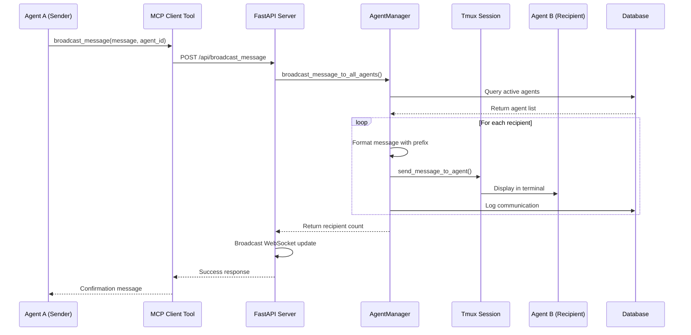

# Agent Communication System

## Overview

The Agent Communication System enables direct peer-to-peer communication between AI agents working in Hephaestus. Agents can broadcast messages to all other agents or send targeted messages to specific agents, facilitating coordination, knowledge sharing, and collaborative problem-solving.

## Architecture

### Message Delivery Mechanism

Messages are delivered using the same tmux `send_keys` infrastructure used by the Guardian system for steering messages. This ensures:
- **Reliable delivery**: Messages appear directly in the agent's Claude Code terminal
- **Consistent format**: Same mechanism as system messages
- **No new dependencies**: Leverages existing infrastructure

### Message Flow



**Text Flow Summary:**
```
Agent A (sender)
    ↓
MCP Client Tool (broadcast_message or send_message)
    ↓
FastAPI Endpoint (/api/broadcast_message or /api/send_message)
    ↓
AgentManager (broadcast_message_to_all_agents or send_direct_message)
    ↓
send_message_to_agent (formats with prefix, sends via tmux)
    ↓
Agent B, C, D... (recipients)
```

### Database Logging

All agent communications are logged to the `AgentLog` table with:
- `log_type`: `"agent_communication"`
- `agent_id`: Recipient agent ID
- `message`: Summary of communication
- `details`: JSON with sender_id, recipient_id, message_type, message_content, timestamp

## API Reference

### MCP Integration

The agent communication system is exposed through the Hephaestus MCP server, allowing Claude Code agents to use these tools directly:

**MCP Tool Names:**
- `mcp__hephaestus__broadcast_message` - Maps to `/api/broadcast_message` endpoint
- `mcp__hephaestus__send_message` - Maps to `/api/send_message` endpoint

These tools are automatically available to agents running in the Hephaestus environment. The MCP client handles authentication via the `X-Agent-ID` header automatically.

### MCP Client Tools

#### `broadcast_message(message: str, sender_agent_id: str)`

Broadcasts a message to all active agents in the system.

**Parameters:**
- `message` (str): The message content to broadcast
- `sender_agent_id` (str): Your agent ID (REQUIRED)

**Returns:**
- Success message with recipient count

**Use cases:**
- Sharing information that affects all agents
- Asking for help when you don't know who to ask
- Announcing completion of shared infrastructure
- Warning about system-wide issues

**Examples:**
```python
broadcast_message(
    message="I found a critical bug in module X that affects everyone",
    sender_agent_id="agent-123"
)

broadcast_message(
    message="Does anyone have information about how authentication works?",
    sender_agent_id="agent-123"
)
```

#### `send_message(message: str, sender_agent_id: str, recipient_agent_id: str)`

Sends a direct message to a specific agent.

**Parameters:**
- `message` (str): The message content
- `sender_agent_id` (str): Your agent ID (REQUIRED)
- `recipient_agent_id` (str): Target agent's ID

**Returns:**
- Success message or error if recipient not found/terminated

**Use cases:**
- Coordinating with an agent on a related task
- Asking a specific agent for information
- Responding to another agent's message
- Providing targeted help or feedback

**Examples:**
```python
# First, check active agents
get_agent_status()

# Then send targeted message
send_message(
    message="I need the API specs you were working on",
    sender_agent_id="agent-123",
    recipient_agent_id="agent-456"
)
```

### FastAPI Endpoints

#### `POST /api/broadcast_message`

**Request:**
```json
{
  "message": "Your message here"
}
```

**Headers:**
- `X-Agent-ID`: Sender's agent ID (required)

**Response:**
```json
{
  "success": true,
  "recipient_count": 3,
  "message": "Message broadcast to 3 agent(s)"
}
```

#### `POST /api/send_message`

**Request:**
```json
{
  "recipient_agent_id": "agent-456",
  "message": "Your message here"
}
```

**Headers:**
- `X-Agent-ID`: Sender's agent ID (required)

**Response:**
```json
{
  "success": true,
  "message": "Message sent to agent 456"
}
```

**Error Response (Recipient Not Found/Terminated):**
```json
{
  "success": false,
  "message": "Failed to send message - recipient agent 87654321 may not exist or is terminated"
}
```

**Error Response (Server Error):**
```json
{
  "detail": "Error message here"
}
```
Status Code: 500

## Message Format

### Broadcast Messages

When an agent broadcasts a message, recipients receive it with this prefix:

```
[AGENT 12345678 BROADCAST]: Your message content here
```

**Note:** Agent IDs are truncated to the first 8 characters for terminal readability. The full agent ID is preserved in database logs for traceability. Messages are wrapped with newlines (`\n`) for clear visual separation in the terminal.

### Direct Messages

When an agent sends a direct message, the recipient receives it with this prefix:

```
[AGENT 12345678 TO AGENT 87654321]: Your message content here
```

Both sender and recipient IDs are truncated to 8 characters for terminal display. Full IDs are maintained in the database `AgentLog` entries for complete audit trails.

## Usage Guidelines

### When to Use Broadcast

✅ **Good use cases:**
- Sharing discoveries that affect multiple agents
- Asking questions when you don't know who has the answer
- Announcing completion of shared components
- Warning about system-wide issues or blockers
- Requesting collaboration on complex problems

❌ **Avoid broadcasting for:**
- Information relevant to only one agent (use direct message)
- Routine status updates (use save_memory instead)
- Responses to direct messages (use direct message)
- Very frequent updates (can be spammy)

### When to Use Direct Messages

✅ **Good use cases:**
- Following up on a specific agent's work
- Coordinating on related tasks
- Responding to a question from another agent
- Requesting specific information from an agent
- Providing targeted feedback or help

❌ **Avoid direct messages for:**
- Information everyone should know (use broadcast)
- Messages to terminated agents (check status first)
- General questions (use broadcast or save_memory)

### Best Practices

1. **Check agent status first**: Use `get_agent_status()` to see active agents before sending direct messages

2. **Be concise**: Keep messages clear and to the point

3. **Respond when helpful**: If you receive a message and can help, respond

4. **Use appropriate tool**: Choose broadcast vs. direct message based on audience

5. **Include context**: Make your messages self-contained with enough context

6. **Avoid spam**: Don't broadcast too frequently; consider save_memory for persistent info

## Implementation Details

### AgentManager Methods

#### `broadcast_message_to_all_agents(sender_agent_id: str, message: str) -> int`

**Location:** `src/agents/manager.py:932-992`

Broadcasts a message to all active agents except the sender.

**Implementation:**
1. Queries database for all active agents (status != "terminated")
2. Excludes the sender from recipient list
3. Formats message with `[AGENT {sender_id[:8]} BROADCAST]:` prefix
4. Sends to each recipient via `send_message_to_agent()`
5. Logs each communication to database
6. Returns count of recipients

#### `send_direct_message(sender_agent_id: str, recipient_agent_id: str, message: str) -> bool`

**Location:** `src/agents/manager.py:994-1049`

Sends a direct message from one agent to another.

**Implementation:**
1. Verifies recipient exists and is active
2. Formats message with `[AGENT {sender[:8]} TO AGENT {recipient[:8]}]:` prefix
3. Sends via `send_message_to_agent()`
4. Logs communication to database
5. Returns success/failure boolean

### Integration with Existing Systems

#### Guardian Steering Messages

The agent communication system uses the same underlying `send_message_to_agent()` method that Guardian uses for steering interventions. This ensures:
- Consistent message delivery
- Proven reliability
- No code duplication

**Guardian message format:**
```
[GUARDIAN GUIDANCE - STUCK]: Check the error in the terminal output
```

**Agent message format:**
```
[AGENT 12345678 BROADCAST]: I found a critical bug
```

#### WebSocket Broadcasting

Both broadcast and direct message endpoints broadcast updates via WebSocket:

**Broadcast event:**
```json
{
  "type": "agent_broadcast",
  "sender_agent_id": "agent-123",
  "recipient_count": 3,
  "message_preview": "First 100 chars..."
}
```

**Direct message event:**
```json
{
  "type": "agent_direct_message",
  "sender_agent_id": "agent-123",
  "recipient_agent_id": "agent-456",
  "message_preview": "First 100 chars..."
}
```

## Testing

See `tests/test_agent_communication.py` for comprehensive tests covering:
- Broadcast to multiple agents
- Direct messaging between agents
- Error handling for invalid recipients
- Message formatting and prefixes
- Integration with tmux sessions

## Future Enhancements

Potential improvements to consider:

1. **Message threads**: Allow agents to reply to specific messages
2. **Message history**: Provide tool to retrieve past communications
3. **Group messaging**: Send to subset of agents (e.g., all agents in a phase)
4. **Priority levels**: Mark urgent messages
5. **Read receipts**: Track which agents have seen messages
6. **Message filtering**: Allow agents to filter by sender or topic

## Security Considerations

- **Agent verification**: All requests require valid `X-Agent-ID` header
- **Message length**: Messages stored in database are truncated to 200 chars
- **Rate limiting**: Consider adding rate limits for broadcast messages
- **Authorization**: Only active agents can send/receive messages

## Troubleshooting

### Message not delivered

**Possible causes:**
- Recipient agent is terminated (check with `get_agent_status()`)
- Tmux session for recipient doesn't exist
- Network/server issue

**Solution:**
- Check agent status before sending
- Review server logs for errors
- Verify recipient agent ID is correct

### No response to broadcast

**This is normal:**
- Agents are not required to respond
- Other agents may be busy or not have relevant information
- Consider using direct message if you know who to ask

### Message formatting issues

**Check:**
- Agent IDs are being truncated correctly (first 8 chars)
- Prefixes are formatted consistently
- Message content doesn't interfere with terminal output

## See Also

- [Monitoring Architecture](monitoring-architecture.md) - Guardian steering messages
- [Validation System](validation-system.md) - Agent feedback mechanisms
- Agent Management - Core agent operations in `src/agents/manager.py`