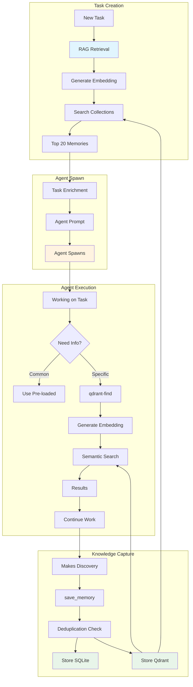
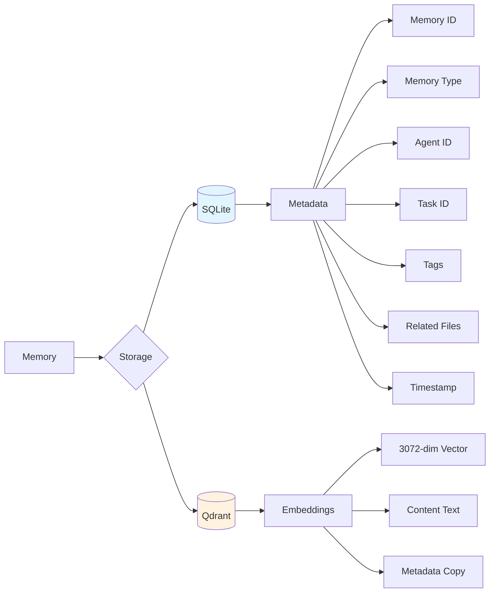
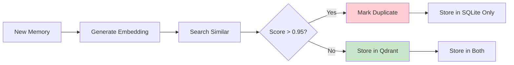
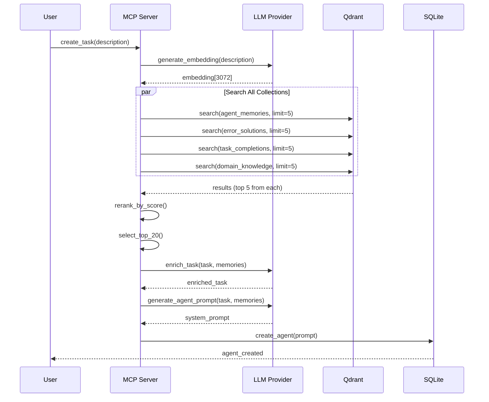
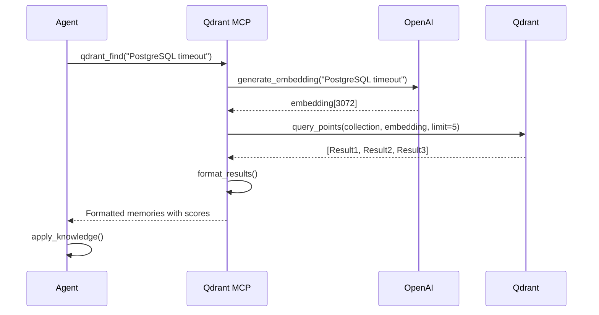
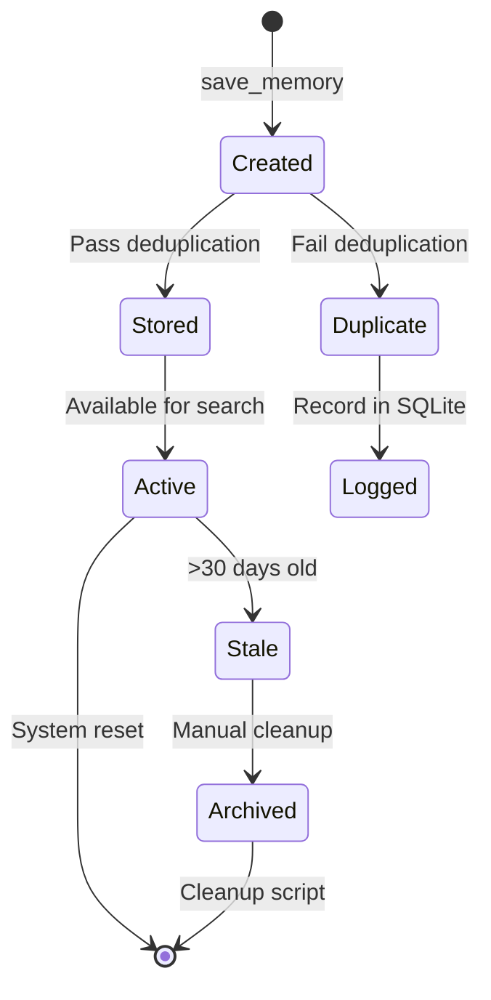

# Memory System (RAG) - Technical Documentation

## Overview

Hephaestus implements a **bidirectional memory system** that enables agents to both write and read shared knowledge. This creates a collective intelligence where all agents benefit from discoveries, solutions, and learnings across the entire system.

## Architecture

### Hybrid Memory Approach



### Two-Tier System

**Tier 1: Pre-loaded Context (80% of needs)**
- Happens at agent spawn time
- RAG retrieves top 20 most relevant memories
- Based on task description similarity
- Embedded in agent's initial system prompt
- Fast, no API calls during execution
- Covers most common scenarios

**Tier 2: Dynamic Search (20% of needs)**
- Available during agent execution
- Agent calls `qdrant-find` tool via MCP
- Semantic search on demand
- For specific errors, edge cases, deep dives
- Real-time knowledge retrieval

## Storage Architecture

### Dual Storage System



### SQLite Schema

**Table: `memories`**
```sql
CREATE TABLE memories (
    id TEXT PRIMARY KEY,              -- UUID
    created_at TIMESTAMP,
    agent_id TEXT,                    -- Creating agent
    content TEXT,                     -- Memory content
    memory_type TEXT,                 -- error_fix, discovery, etc.
    embedding_id TEXT,                -- Qdrant vector ID
    related_task_id TEXT,             -- Associated task
    tags JSON,                        -- Searchable tags
    related_files JSON,               -- File paths
    extra_data JSON,                  -- Additional metadata
    FOREIGN KEY (agent_id) REFERENCES agents(id),
    FOREIGN KEY (related_task_id) REFERENCES tasks(id)
);
```

### Qdrant Collections

**Primary Collection: `hephaestus_agent_memories`**
```python
{
    "name": "hephaestus_agent_memories",
    "vectors": {
        "size": 3072,  # OpenAI text-embedding-3-large
        "distance": "Cosine"
    },
    "payload_schema": {
        "content": "text",
        "memory_type": "keyword",
        "agent_id": "keyword",
        "task_id": "keyword",
        "timestamp": "datetime",
        "tags": "keyword[]",
        "related_files": "text[]"
    }
}
```

**Other Collections:**
- `hephaestus_static_docs` - Documentation files
- `hephaestus_task_completions` - Historical task data
- `hephaestus_error_solutions` - Known error fixes
- `hephaestus_domain_knowledge` - CVEs, CWEs, standards
- `hephaestus_project_context` - Current project state

## Memory Types

### Taxonomy

| Type | Description | When to Use | Example |
|------|-------------|-------------|---------|
| **error_fix** | Solutions to errors | After fixing a bug | "Fixed PostgreSQL timeout by increasing pool_size to 20" |
| **discovery** | Important findings | New insights about code | "Authentication uses JWT with 24h expiry" |
| **decision** | Key decisions & rationale | After making design choice | "Chose Redis over Memcached for pub/sub support" |
| **learning** | Lessons learned | After completing task | "Always validate input before SQL queries" |
| **warning** | Gotchas to avoid | Encountered edge case | "Don't use os.fork() with SQLite connections" |
| **codebase_knowledge** | Code structure insights | Understanding architecture | "API routes are defined in src/api/routes/" |

### Type Usage Guidelines

**error_fix:**
```python
await save_memory(
    memory_type="error_fix",
    content="ModuleNotFoundError: Fixed by adding src/ to PYTHONPATH in pytest.ini",
    tags=["pytest", "imports", "python"],
    related_files=["pytest.ini", "tests/conftest.py"]
)
```

**discovery:**
```python
await save_memory(
    memory_type="discovery",
    content="Database migrations run automatically on server start via Alembic",
    tags=["database", "migrations", "alembic"],
    related_files=["src/db/migrations/", "alembic.ini"]
)
```

**decision:**
```python
await save_memory(
    memory_type="decision",
    content="Using FastAPI over Flask for async support and auto-generated OpenAPI docs",
    tags=["framework", "fastapi", "architecture"]
)
```

## Embedding Model

### OpenAI text-embedding-3-large

**Specifications:**
- **Dimensions**: 3072
- **Context window**: 8,191 tokens
- **Cost**: $0.00013 per 1K tokens
- **Quality**: State-of-the-art semantic understanding

**Why this model:**
1. **High dimensionality** - Better semantic capture
2. **Superior quality** - Outperforms smaller models
3. **Consistent usage** - Same model across all memories
4. **Future-proof** - Latest OpenAI technology

**Alternative considered:**
- `sentence-transformers/all-MiniLM-L6-v2` (384-dim)
  - Rejected: Too low dimensionality
  - Rejected: Quality issues with technical content

## Deduplication System

### Similarity Threshold: 0.95



**Rationale:**
- Prevents redundant knowledge storage
- Reduces vector storage costs
- Maintains uniqueness of insights
- Threshold chosen empirically (>95% = nearly identical)

**Edge cases:**
- Similar but distinct memories (score 0.85-0.94) → Stored separately
- Exact duplicates (score >0.99) → Flagged in SQLite
- Different perspectives on same topic → Welcome diversity

## RAG Retrieval Flow

### At Task Creation



### During Agent Execution



## MCP Integration

### Hephaestus MCP Tools

**1. save_memory**
```python
{
    "tool": "mcp__hephaestus__save_memory",
    "parameters": {
        "content": str,           # Memory content (required)
        "agent_id": str,          # Your agent ID (required)
        "memory_type": str,       # Type from taxonomy (required)
        "tags": List[str],        # Optional tags
        "related_files": List[str],  # Optional file paths
        "extra_data": Dict        # Optional metadata
    }
}
```

**Example:**
```python
save_memory(
    content="Fixed CORS by adding allow_origins=['*'] to FastAPI middleware",
    agent_id="agent-123",
    memory_type="error_fix",
    tags=["cors", "fastapi", "middleware"],
    related_files=["src/main.py"]
)
```

### Qdrant MCP Tools (Custom)

**2. qdrant_find**
```python
{
    "tool": "qdrant_find",
    "parameters": {
        "query": str,    # Natural language search query
        "limit": int     # Max results (default: 5)
    }
}
```

**Example:**
```python
qdrant_find(
    query="How to handle PostgreSQL connection pooling",
    limit=3
)
# Returns:
# [1] Score: 0.847 | Type: discovery
#     PostgreSQL connection pool configured with max_connections=20...
# [2] Score: 0.782 | Type: error_fix
#     Fixed connection timeout by setting pool_timeout=30...
# [3] Score: 0.735 | Type: decision
#     Chose asyncpg over psycopg2 for async support...
```

### Custom Qdrant MCP Server

**Why custom:**
- Default `mcp-server-qdrant` uses FastEmbed (max 1024-dim)
- Hephaestus uses OpenAI embeddings (3072-dim)
- Dimension mismatch → errors

**Solution:**
- Created `qdrant_mcp_openai.py`
- Uses OpenAI embeddings directly
- Matches existing Qdrant collections

**Configuration:**
```bash
claude mcp add -s user qdrant python /path/to/qdrant_mcp_openai.py \
  -e QDRANT_URL=http://localhost:6333 \
  -e COLLECTION_NAME=hephaestus_agent_memories \
  -e OPENAI_API_KEY=$OPENAI_API_KEY \
  -e EMBEDDING_MODEL=text-embedding-3-large
```

## Agent Prompts

### System Prompt Template

Agents receive this guidance:

```markdown
═══ PRE-LOADED CONTEXT ═══
Top 10 relevant memories (use qdrant-find for more):
- Memory 1: [content preview]
- Memory 2: [content preview]
...

═══ AVAILABLE TOOLS ═══

Hephaestus MCP (task management):
• save_memory - Save discoveries for other agents

Qdrant MCP (memory search):
• qdrant-find - Search agent memories semantically
  Use when: encountering errors, needing implementation details
  Example: "qdrant-find 'PostgreSQL connection timeout solutions'"
  Note: Pre-loaded context covers most needs; search for specifics

═══ WORKFLOW ═══
1. Work on your task using pre-loaded context
2. Use qdrant-find if you need specific information
3. Save important discoveries via save_memory
```

### When Agents Use qdrant-find

**Common scenarios:**
1. **Encountering errors not in pre-loaded context**
   ```python
   "qdrant-find 'ModuleNotFoundError when importing src modules'"
   ```

2. **Need implementation details**
   ```python
   "qdrant-find 'how authentication middleware is configured'"
   ```

3. **Finding related work**
   ```python
   "qdrant-find 'previous API rate limiting implementations'"
   ```

4. **Exploring patterns**
   ```python
   "qdrant-find 'database migration strategies used in this project'"
   ```

## Performance Characteristics

### Pre-loaded Context (Tier 1)

| Metric | Value |
|--------|-------|
| Retrieval time | ~2-3 seconds |
| API calls | 1 embedding generation |
| Cost per task | ~$0.00003 |
| Coverage | 80% of agent needs |
| Context size | Top 20 memories (~4KB) |

### Dynamic Search (Tier 2)

| Metric | Value |
|--------|-------|
| Query time | ~1-2 seconds |
| API calls | 1 embedding per search |
| Cost per search | ~$0.000003 |
| Usage | 20% of agent needs |
| Results | Top 5 by default |

### Storage

| Metric | Value |
|--------|-------|
| Current memories | 1,085+ |
| Vector storage | ~12MB (3072-dim × 1085) |
| SQLite size | ~500KB |
| Growth rate | ~50-100 memories/day |

## Best Practices

### For Agents

**✅ DO:**
- Use pre-loaded context first
- Save memories after significant discoveries
- Use specific queries for qdrant-find
- Include relevant tags and file paths
- Choose appropriate memory types

**❌ DON'T:**
- Search for info already in pre-loaded context
- Save trivial or obvious information
- Use vague queries like "help me"
- Duplicate existing memories
- Omit context in memory content

### For System Operators

**Maintenance:**
```bash
# Check collection health
curl http://localhost:6333/collections/hephaestus_agent_memories

# View recent memories
python scripts/view_memories.py --limit 10

# Clean stale memories (when starting new project)
python scripts/clean_qdrant.py

# Reinitialize collections
python scripts/init_qdrant.py
```

**Monitoring:**
- Track memory growth rate
- Monitor search quality (relevance scores)
- Identify duplicate patterns
- Audit memory type distribution

## Troubleshooting

### Common Issues

**1. No search results**
```bash
# Check Qdrant is running
curl http://localhost:6333/collections

# Verify collection exists
python -c "from qdrant_client import QdrantClient; \
  client = QdrantClient('http://localhost:6333'); \
  print(client.count('hephaestus_agent_memories'))"

# Check for data
curl http://localhost:6333/collections/hephaestus_agent_memories/points/count
```

**2. Dimension mismatch errors**
```
Error: Wrong input: Vector dimension error: expected dim: 3072, got 1536
```
**Solution:** Ensure using custom Qdrant MCP with OpenAI embeddings, not default FastEmbed.

**3. High API costs**
```bash
# Monitor embedding generation
grep "generate_embedding" logs/server.log | wc -l

# If too high:
# - Increase pre-loaded context (top 30 instead of 20)
# - Cache common queries
# - Batch embedding generation
```

**4. Poor search quality**
```bash
# Symptoms: Irrelevant results, low scores (<0.3)

# Solutions:
# - Improve query specificity
# - Add more diverse memories
# - Check for stale/outdated memories
# - Consider reindexing with better metadata
```

## Advanced Topics

### Multi-Collection Search

Future enhancement to search across all collections:

```python
results = await vector_store.search_all_collections(
    query_vector=embedding,
    limit_per_collection=5,
    total_limit=20
)
# Returns merged results from all 6 collections
```

### Memory Lifecycle



### Semantic Search Internals

**Cosine Similarity:**
```python
similarity = dot(query_vec, memory_vec) / (norm(query_vec) * norm(memory_vec))
# Range: [-1, 1]
# Typical results: 0.3-0.9 for relevant memories
```

**Score interpretation:**
- **0.8-1.0**: Highly relevant, nearly exact match
- **0.6-0.8**: Very relevant, good semantic match
- **0.4-0.6**: Moderately relevant, related concept
- **0.2-0.4**: Loosely relevant, tangential
- **Below 0.2**: Not relevant, different topic

## Future Enhancements

### Planned Features

1. **Memory Consolidation**
   - Merge similar memories periodically
   - LLM-powered summarization
   - Keep best versions

2. **Memory Expiration**
   - Auto-archive old memories
   - Configurable TTL per type
   - Reactivation on demand

3. **Smart Tagging**
   - Auto-generate tags from content
   - Hierarchical tag structure
   - Tag-based filtering

4. **Quality Scoring**
   - Track memory usefulness
   - Upvote/downvote by agents
   - Promote high-quality memories

5. **Cross-Project Sharing**
   - Export/import memory sets
   - Public memory marketplace
   - Template memory packs

## References

- [Qdrant Documentation](https://qdrant.tech/documentation/)
- [OpenAI Embeddings Guide](https://platform.openai.com/docs/guides/embeddings)
- [RAG Best Practices](https://docs.anthropic.com/claude/docs/retrieval-augmented-generation)
- [Vector Search Tutorial](https://www.pinecone.io/learn/vector-search/)

---

**Last Updated:** 2025-09-30
**Version:** 1.0