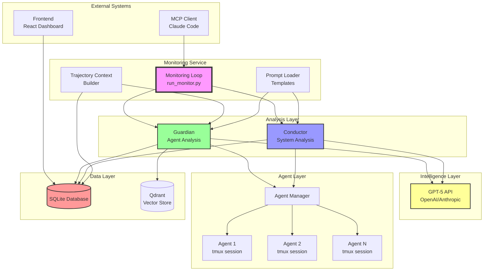
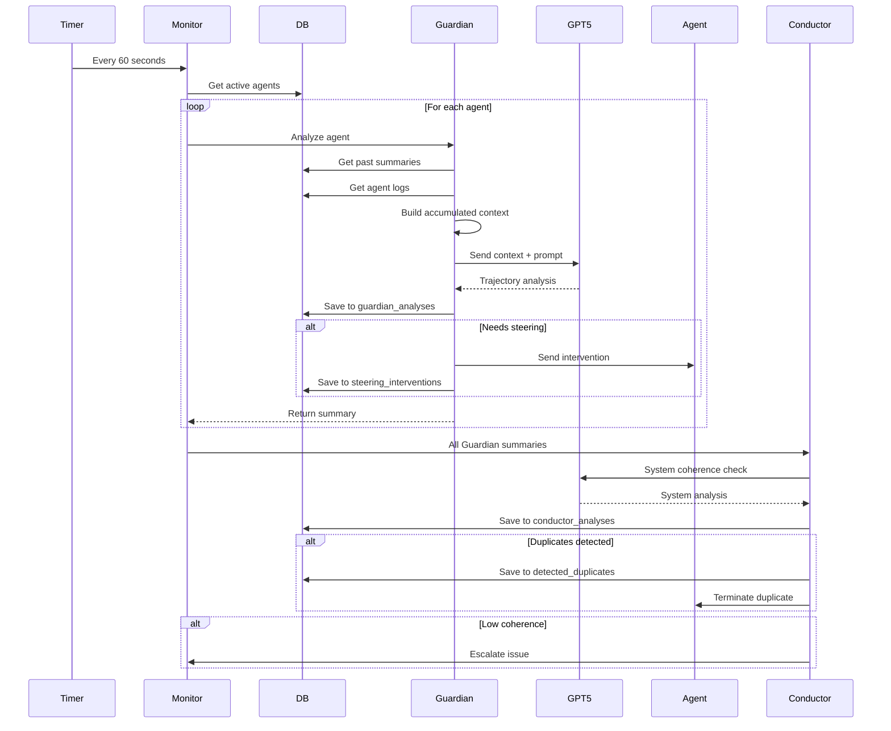
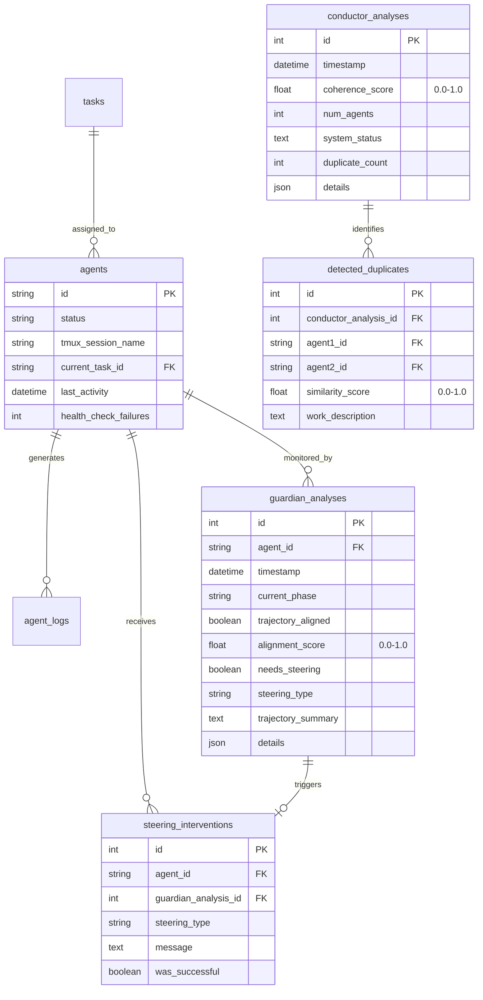
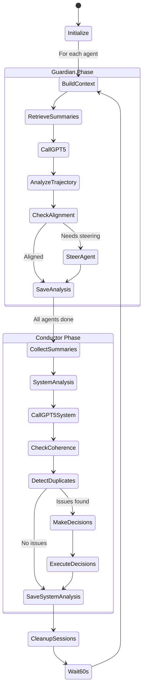
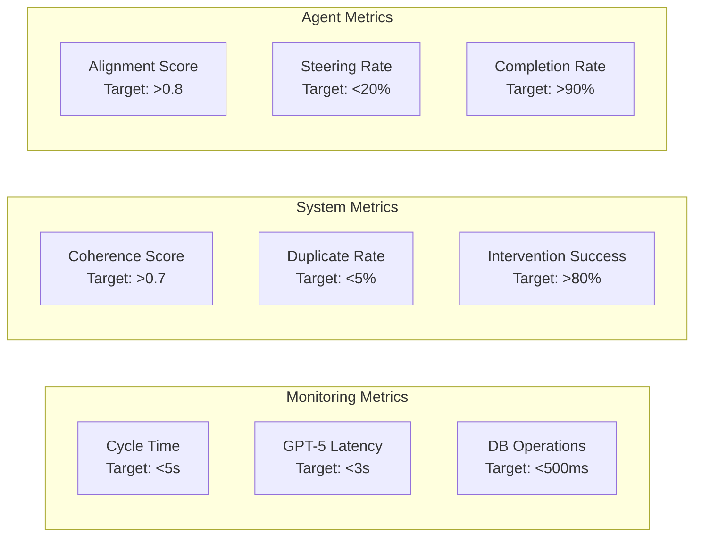
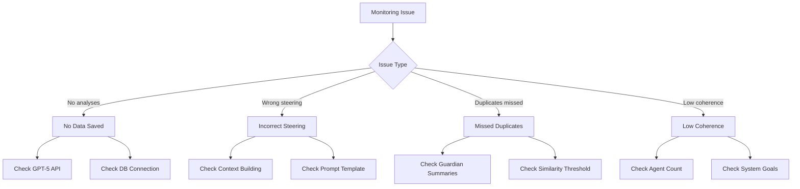
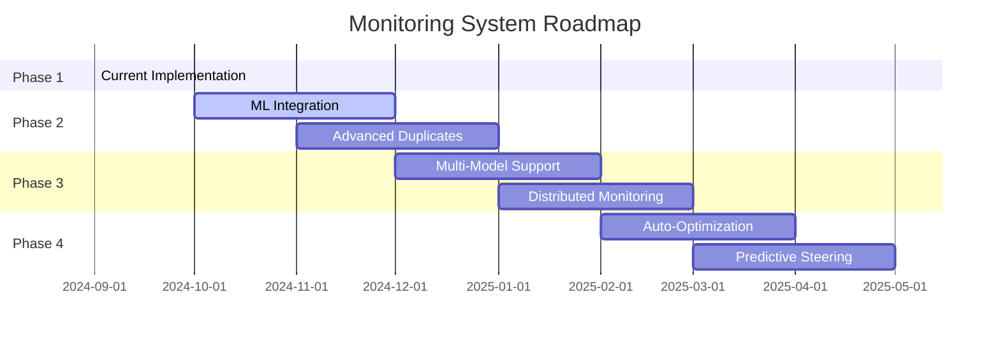

# Hephaestus Monitoring Architecture - Implementation Deep Dive

> **📚 Looking for the user guide?** This is a technical deep-dive for contributors and advanced users. If you want to understand how Guardian works from a user perspective, see [Guardian Monitoring Guide](../guides/guardian-monitoring.md).

## System Architecture Overview



## Component Details

### Monitoring Loop
- **Location**: `run_monitor.py`, `src/monitoring/monitor.py`
- **Responsibility**: Orchestrates the monitoring cycle every 60 seconds
- **Key Methods**:
  - `_monitoring_cycle()`: Main cycle execution
  - `_guardian_analysis_for_agent()`: Individual agent analysis
  - `_save_conductor_analysis()`: System analysis persistence

### Guardian System
- **Location**: `src/monitoring/guardian.py`
- **Responsibility**: Individual agent trajectory monitoring
- **Key Features**:
  - Grace period for new agents (default: 60 seconds) before monitoring begins
  - Builds accumulated context from entire conversation
  - Retrieves and uses past summaries for continuity
  - Calls GPT-5 for intelligent trajectory analysis
  - Provides targeted steering interventions

### Conductor System
- **Location**: `src/monitoring/conductor.py`
- **Responsibility**: System-wide coherence and orchestration
- **Key Features**:
  - Analyzes all Guardian summaries collectively
  - Detects duplicate work across agents
  - Makes termination and coordination decisions
  - Maintains system coherence score

### Trajectory Context Builder
- **Location**: `src/monitoring/trajectory_context.py`
- **Responsibility**: Extracts meaningful context from agent history
- **Key Extractions**:
  - Overall goals and their evolution
  - Persistent and lifted constraints
  - Standing instructions
  - Current focus and blockers

### Prompt Loader
- **Location**: `src/monitoring/prompt_loader.py`, `src/prompts/`
- **Responsibility**: Manages GPT-5 prompt templates
- **Templates**:
  - `guardian_trajectory_analysis.md` - Guardian agent analysis prompts
  - `conductor_system_analysis.md` - Conductor system analysis prompts
- **Key Features**:
  - Dynamic template loading from markdown files
  - Context injection using Python `.format()`
  - Structured JSON response formatting

## Data Flow



## Database Schema



## Monitoring Cycle Phases



## Key Algorithms

### Accumulated Context Building

```python
def build_accumulated_context(agent_id: str) -> Dict[str, Any]:
    """
    Builds complete context from agent's entire session.

    1. Get all agent logs ordered by time
    2. Extract overall goal from task and conversation
    3. Track goal evolution through conversation
    4. Extract persistent constraints ("must", "cannot")
    5. Identify lifted constraints
    6. Extract standing instructions ("always", "remember")
    7. Identify current focus (most recent activity)
    8. Discover blockers from errors and stuck patterns
    9. Calculate session duration and conversation length

    Returns structured context for GPT-5 analysis.
    """
```

### Trajectory Alignment Scoring

```python
def calculate_alignment_score(
    trajectory: Dict[str, Any],
    goal: str,
    constraints: List[str]
) -> float:
    """
    GPT-5 calculates alignment score (0.0-1.0) based on:

    - Goal progress (0-40%):
      * How much of the goal is completed
      * Whether work contributes to goal

    - Constraint adherence (0-30%):
      * Following active constraints
      * Not violating any constraints

    - Efficiency (0-20%):
      * Not stuck or repeating
      * Making forward progress

    - Focus (0-10%):
      * Staying on current task
      * Not context switching

    The score is determined by GPT-5's analysis of the agent's
    trajectory_summary against the accumulated_goal and constraints.
    """
```

### Duplicate Detection

```python
def detect_duplicates(
    summaries: List[Dict[str, Any]]
) -> List[Dict[str, Any]]:
    """
    GPT-5 detects duplicates by analyzing:

    1. Work descriptions similarity
    2. File/component overlap
    3. Goal similarity
    4. Approach similarity

    Returns list of duplicate pairs with similarity scores.
    """
```

## Performance Metrics



## Configuration Parameters

```yaml
# Monitoring Settings
monitoring:
  interval_seconds: 60                 # How often to run monitoring cycle
  parallel_analysis: true              # Analyze agents in parallel
  max_concurrent: 10                   # Max concurrent Guardian analyses
  guardian_min_agent_age_seconds: 60   # Grace period before Guardian monitors new agents

# Guardian Settings
guardian:
  past_summaries_limit: 10    # Number of past summaries to include
  context_history_lines: 200  # Lines of conversation to include
  tmux_output_lines: 100      # Lines from tmux to analyze
  cache_duration_minutes: 5   # How long to cache summaries

# Conductor Settings
conductor:
  min_agents_for_analysis: 2  # Minimum agents for system analysis
  duplicate_threshold: 0.8    # Similarity score for duplicates
  coherence_thresholds:
    critical: 0.3             # Below this triggers escalation
    warning: 0.5              # Below this increases monitoring
    healthy: 0.7              # Above this is normal

# Intervention Settings
interventions:
  max_nudges_before_restart: 3
  restart_cooldown_minutes: 10
  steering_types:
    - general
    - stuck
    - confused
    - wrong_direction
    - violating_constraints
```

## Integration Points

### MCP Server Endpoints

```python
# Get agent trajectories
GET /api/agent_trajectories
Response: {
    "agents": [
        {
            "agent_id": "uuid",
            "current_phase": "implementation",
            "alignment_score": 0.85,
            "trajectory_summary": "Building auth..."
        }
    ]
}

# Get system coherence
GET /api/system_coherence
Response: {
    "coherence_score": 0.75,
    "active_agents": 5,
    "duplicates": 1,
    "system_status": "Healthy with minor duplicates"
}

# Manual steering
POST /api/steer_agent
Body: {
    "agent_id": "uuid",
    "steering_type": "stuck",
    "message": "Try using X approach"
}
```

### Frontend Dashboard Integration

```typescript
// Real-time monitoring data
interface MonitoringData {
    agents: AgentTrajectory[];
    systemCoherence: number;
    duplicates: Duplicate[];
    interventions: Intervention[];
}

// WebSocket updates
ws.on('monitoring_update', (data: MonitoringData) => {
    updateAgentGrid(data.agents);
    updateCoherenceChart(data.systemCoherence);
    highlightDuplicates(data.duplicates);
});
```

## Troubleshooting Guide

### Common Issues



### Debug Commands

```bash
# Check monitoring logs
tail -f logs/monitor.log | grep -E "Guardian|Conductor"

# Check database state
sqlite3 hephaestus.db "
    SELECT COUNT(*) as analyses,
           AVG(alignment_score) as avg_score
    FROM guardian_analyses
    WHERE timestamp > datetime('now', '-1 hour');
"

# Check system coherence
sqlite3 hephaestus.db "
    SELECT timestamp, coherence_score, system_status
    FROM conductor_analyses
    ORDER BY timestamp DESC LIMIT 5;
"

# Check for stuck agents
sqlite3 hephaestus.db "
    SELECT agent_id, COUNT(*) as stuck_count
    FROM guardian_analyses
    WHERE needs_steering = 1
    GROUP BY agent_id
    HAVING stuck_count > 3;
"
```

## Future Enhancements

### Planned Features

1. **Machine Learning Integration**
   - Learn from successful interventions
   - Predict trajectory deviations
   - Optimize steering messages

2. **Advanced Duplicate Detection**
   - Semantic code analysis
   - Git diff integration
   - Automatic work redistribution

3. **Multi-Model Support**
   - Claude for trajectory analysis
   - GPT-4 for code understanding
   - Specialized models for different phases

4. **Enhanced Visualizations**
   - Real-time trajectory graphs
   - System coherence heatmaps
   - Intervention effectiveness charts

### Scalability Roadmap

