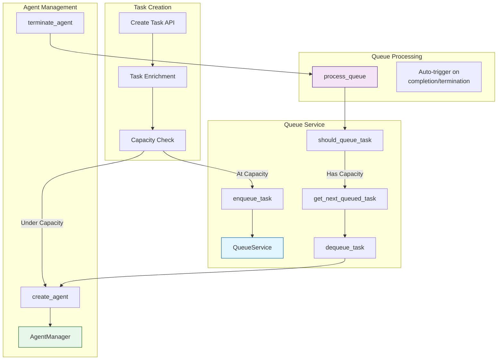
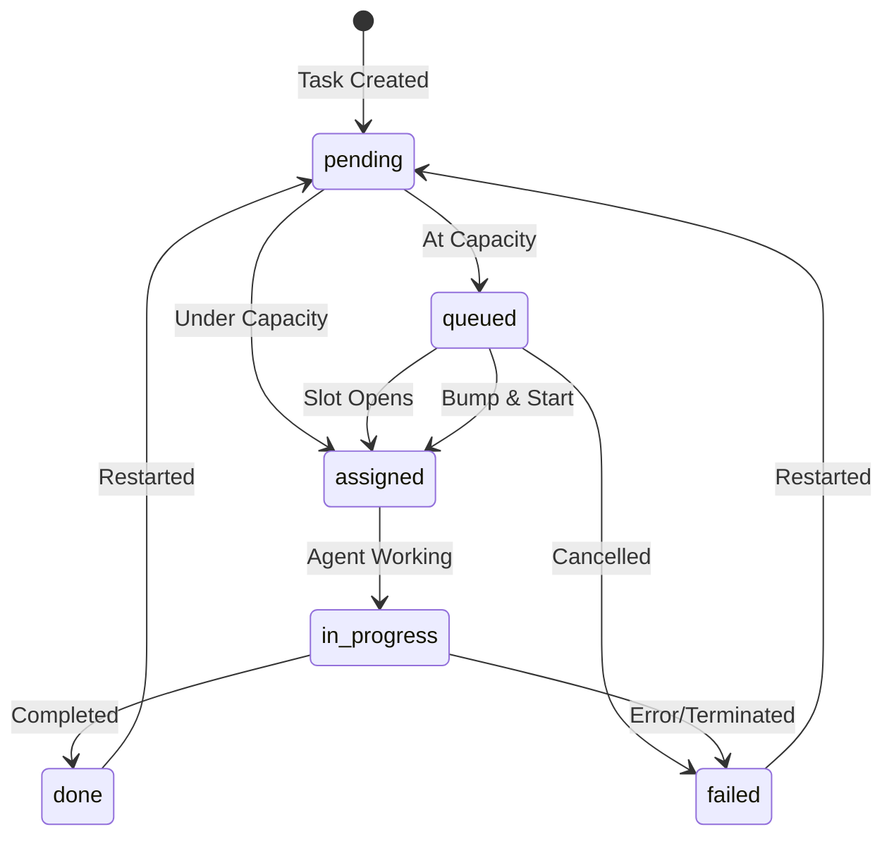
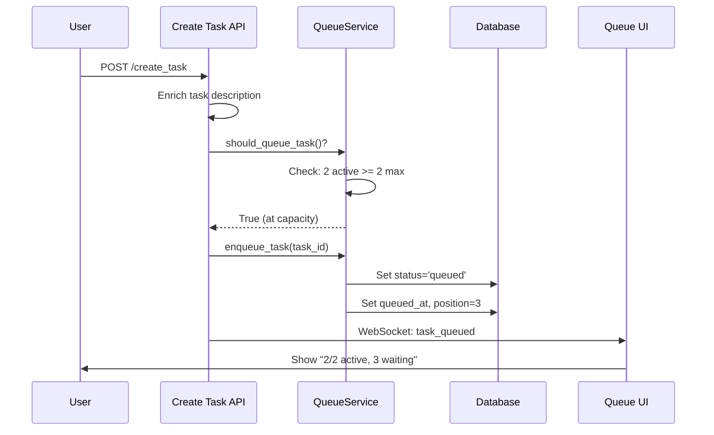

# Queue and Task Management System

## Overview

The Queue and Task Management system provides intelligent concurrency control and task lifecycle management for Hephaestus. It allows administrators to:

- **Control resource usage** by limiting concurrent agents
- **Queue tasks** when at capacity instead of overwhelming the system
- **Prioritize urgent work** with "Bump & Start" functionality
- **Manage running agents** by terminating them when needed
- **Restart tasks** that failed or need to be re-run
- **Cancel queued tasks** that are no longer needed

This system prevents machine freezing from too many concurrent agents and reduces token usage by queuing work intelligently.

### Architecture Overview



---

## Quick Reference

| Action | Endpoint | Effect |
|--------|----------|--------|
| Check queue status | `GET /api/queue_status` | View active agents, queued tasks |
| Start queued task now | `POST /api/bump_task_priority` | Bypass limit, start immediately |
| Cancel queued task | `POST /api/cancel_queued_task` | Remove from queue, mark as failed |
| Restart task | `POST /api/restart_task` | Reset and re-queue/start task |
| Terminate agent | `POST /api/terminate_agent` | Kill agent, process queue |

**Key Concepts:**
- **At capacity:** Active agents = max_concurrent_agents
- **Queued:** Task waiting for an agent slot to open
- **Bump & Start:** Bypass limit to start urgent task immediately
- **Auto-processing:** Queue advances automatically when agents complete

---

## Configuration

### Max Concurrent Agents

The system is configured via `hephaestus_config.yaml`:

```yaml
mcp:
  max_concurrent_agents: 2  # Maximum number of agents that can run simultaneously
```

**Configuration Details:**
- **Config file:** `hephaestus_config.yaml` (root directory)
- **SDK support:** Can also be set via Python SDK
- **Environment variables:** Not supported (by design, for consistency)
- **Default value:** 10 agents
- **Recommended range:** 2-5 for development, 5-10 for production

### Queue Behavior

When a new task is created:

1. **Under capacity** (e.g., 1/2 active agents):
   - Task is enriched immediately
   - Agent is created and started right away
   - Task status: `pending` → `assigned` → `in_progress`

2. **At capacity** (e.g., 2/2 active agents):
   - Task is enriched immediately (ready to start when slot opens)
   - Task is added to queue
   - Task status: `pending` → `queued`
   - When an agent completes/terminates, queue automatically processes next task

---

## Task State Machine

Understanding how tasks flow through the queue system:



### Queue Priority System

Tasks in the queue are ordered by:

1. **Priority Boosted** (manually bumped tasks) - highest priority
2. **Task Priority** (high > medium > low)
3. **Queue Time** (FIFO - first in, first out)

### Queue Position

Each queued task has:
- `queue_position`: Integer position in queue (1, 2, 3...)
- `priority_boosted`: Boolean flag for manually prioritized tasks
- `queued_at`: Timestamp when task was queued

Position #1 is "NEXT UP" - will start as soon as a slot opens.

---

## Task Actions

### 1. Bump & Start (Start Now)

**Purpose:** Force a queued task to start immediately, bypassing the agent limit.

**Behavior:**
- Moves task to queue position #1 (if not already)
- **Bypasses max concurrent agents limit**
- Creates agent immediately
- System goes over capacity (e.g., 2/2 → 3/2)
- When agents complete, system naturally returns to configured limit

**Use Case:** Urgent work that can't wait for a slot to open.

**API Endpoint:** `POST /api/bump_task_priority`

**Request:**
```json
{
  "task_id": "task-uuid"
}
```

**Response:**
```json
{
  "success": true,
  "message": "Task abc123 started immediately (bypassing agent limit)",
  "agent_id": "agent-uuid"
}
```

**UI Locations:**
- Task Details modal: Orange "Start Now" button (for queued tasks)
- Queue section: ⚡ icon button (hover to reveal)

### 2. Cancel Queued Task

**Purpose:** Remove a task from the queue and mark it as failed.

**Behavior:**
- Task is removed from queue
- Task status set to `failed`
- Failure reason: "Cancelled by user from queue"
- No agent is created

**Use Case:** Task no longer needed or was created by mistake.

**API Endpoint:** `POST /api/cancel_queued_task`

**Request:**
```json
{
  "task_id": "task-uuid"
}
```

**Response:**
```json
{
  "success": true,
  "message": "Task abc123 cancelled and removed from queue"
}
```

**UI Location:**
- Queue section: 🗑️ trash icon button (hover to reveal)

### 3. Restart Task

**Purpose:** Restart a completed or failed task with a clean slate.

**Behavior:**
- Clears all completion data:
  - `failure_reason`
  - `completion_notes`
  - `completed_at`
  - `started_at`
  - `assigned_agent_id`
- **Clears all trajectory data:**
  - Guardian analyses for old agent
  - Steering interventions for old agent
- Resets task to `pending` status
- If under capacity → creates agent immediately
- If at capacity → queues task

**Use Case:** Retry failed tasks or re-run completed tasks.

**API Endpoint:** `POST /api/restart_task`

**Request:**
```json
{
  "task_id": "task-uuid"
}
```

**Response (started immediately):**
```json
{
  "success": true,
  "message": "Task abc123 restarted with new agent",
  "agent_id": "agent-uuid",
  "status": "assigned"
}
```

**Response (queued):**
```json
{
  "success": true,
  "message": "Task abc123 restarted and added to queue",
  "status": "queued"
}
```

**UI Location:**
- Task Details modal: Purple "Restart Task" button (for done/failed tasks only)

### 4. Terminate Agent

**Purpose:** Forcefully stop a running agent and fail its task.

**Behavior:**
- Terminates tmux session
- Marks agent as `terminated`
- Marks task as `failed`
- Frees up agent slot
- Queue automatically processes next task

**Use Case:** Agent is stuck, doing wrong work, or need to free capacity.

**API Endpoint:** `POST /api/terminate_agent`

**Request:**
```json
{
  "agent_id": "agent-uuid",
  "reason": "Manual termination from UI"
}
```

**Response:**
```json
{
  "success": true,
  "message": "Agent abc123 terminated successfully"
}
```

**UI Locations:**
- Task Details modal: Red "Terminate Agent" button (for active agents)
- Agents page: Red "Terminate Agent" button on agent cards
- Queue section (running agents): ❌ icon button (hover to reveal)

---

## Queue Section UI Component

The Queue Section appears at the top of the Tasks page when the system is at capacity or has queued tasks.

### Collapsed State (~48px height)

Shows at-a-glance info:
- Agent utilization bar
- Slot count (e.g., 2/2)
- Preview of next task
- Number of waiting tasks

### Expanded State (max ~300px, scrollable)

Shows two sections:

**Running Agents:**
- List of active agents
- Current task for each agent
- Runtime duration
- Quick actions: View (👁️), Terminate (❌)

**Queued Tasks:**
- List of queued tasks in priority order
- Position badges (1, 2, 3...)
- Task #1 highlighted as "NEXT UP" (orange background)
- Priority badges (HIGH/MED/LOW)
- Time queued
- Quick actions: View (👁️), Start Now (⚡), Cancel (🗑️)
- Max height: 200px with scroll

### Real-time Updates

The Queue Section subscribes to WebSocket events for instant updates. See [WebSocket Events](#websocket-events) section below for complete event reference.

---

## WebSocket Events

The queue system emits real-time events for UI updates:

| Event Type | When Emitted | Payload Fields |
|------------|--------------|----------------|
| `task_queued` | Task added to queue | `task_id`, `description`, `queue_position`, `slots_available` |
| `task_created` | New task created | `task_id`, `description`, `agent_id` (if started immediately) |
| `task_completed` | Task finished | `task_id`, `agent_id`, `status`, `summary` |
| `task_priority_bumped` | Task bumped and started | `task_id`, `agent_id` |
| `agent_created` | New agent spawned | `agent_id`, `task_id` |
| `agent_status_changed` | Agent status updated | `agent_id`, `status` |

**UI Components Subscribed:**
- QueueSection: All events
- TasksPage: `task_*` events
- AgentList: `agent_*` events

---

## Implementation Details

### Queue Service (`src/services/queue_service.py`)

Core methods:

**`should_queue_task() -> bool`**
- Checks if active agent count >= max concurrent agents
- Returns True if task should be queued instead of started

**`enqueue_task(task_id: str) -> None`**
- Adds task to queue
- Sets `status = "queued"`
- Sets `queued_at = now()`
- Calculates `queue_position`
- Automatically recalculates all queue positions

**`get_next_queued_task() -> Task | None`**
- Returns highest priority queued task
- Ordering: priority_boosted > priority > queued_at
- Returns None if queue is empty

**`dequeue_task(task_id: str) -> None`**
- Removes task from queue
- Sets task status to `"assigned"`
- Clears queue metadata (queue_position)
- Recalculates positions for remaining tasks

**`boost_task_priority(task_id: str) -> bool`**
- Sets `priority_boosted = True`
- Moves task to position #1
- Recalculates all queue positions
- Returns success status

**`get_queue_status() -> dict`**
- Returns complete queue state:
  - Active agent count
  - Max concurrent agents
  - Queued tasks (with details)
  - Available slots
  - At capacity status

### Automatic Queue Processing

**When does the queue process?**

The `process_queue()` function is called automatically when:
1. A task completes (status → `done`)
2. A task fails (status → `failed`)
3. An agent is terminated

**What happens?**

```python
async def process_queue():
    # Check capacity first
    if should_queue_task():
        return  # At capacity, don't process

    # Get next queued task
    next_task = get_next_queued_task()
    if not next_task:
        return  # Queue is empty

    # Dequeue and start
    dequeue_task(next_task.id)
    create_agent_for_task(next_task)
```

**Key Point:** Queue processing **respects** the max concurrent agents limit. Only "Bump & Start" bypasses it.

### Database Schema

Queue management fields added to the Task model:

**Location:** `src/core/database.py`

```python
class Task(Base):
    __tablename__ = "tasks"

    # ... existing fields (id, description, status, etc.) ...

    # Queue management fields
    queued_at = Column(DateTime)           # Timestamp when task was queued
    queue_position = Column(Integer)       # Position in queue (1, 2, 3...)
    priority_boosted = Column(Boolean, default=False)  # Manual priority boost flag
```

**Field Usage:**
- `queued_at`: Set when task enters queue, used for FIFO ordering within same priority
- `queue_position`: Calculated field showing task's place in line, displayed in UI
- `priority_boosted`: Set to True when "Bump & Start" is used, gives highest priority

**Note:** These fields are NULL for tasks that never enter the queue (started immediately).

---

## API Endpoints Summary

| Endpoint | Method | Purpose | Bypasses Limit? |
|----------|--------|---------|-----------------|
| `/api/bump_task_priority` | POST | Start queued task immediately | ✅ Yes |
| `/api/cancel_queued_task` | POST | Remove task from queue | N/A |
| `/api/restart_task` | POST | Restart done/failed task | ❌ No |
| `/api/terminate_agent` | POST | Kill running agent | N/A |
| `/api/queue_status` | GET | Get queue state | N/A |

---

## User Workflows

### Workflow 1: System at Capacity

**Scenario:** You have 2/2 agents running, create a new task.



**Steps:**
1. New task is created
2. System checks capacity: `should_queue_task()` returns True
3. Task is enriched (ready to start)
4. Task is queued at position #3
5. Queue section appears on Tasks page
6. User sees: "2/2 active, 3 waiting"

**What happens next:**
- When an agent completes → queue automatically processes → task #1 starts
- User can "Start Now" to bypass limit → goes to 3/2 temporarily

### Workflow 2: Urgent Task in Queue

**Scenario:** Task at position #5 is suddenly urgent.

1. Open Tasks page
2. Expand queue section
3. Find task at position #5
4. Click ⚡ "Start Now" button
5. Confirm: "This will bypass the agent limit"
6. Task starts immediately (2/2 → 3/2)
7. When any agent completes → back to 2/2
8. Queue continues processing normally

### Workflow 3: Restart Failed Task

**Scenario:** Task failed, want to try again.

1. Open task in Task Details modal
2. See status: "failed"
3. Click purple "Restart Task" button
4. Confirm: "This will clear completion data and trajectory"
5. If under capacity → task starts immediately
6. If at capacity → task is queued
7. Old trajectory data is deleted
8. Fresh agent starts from scratch

### Workflow 4: Cancel Unwanted Task

**Scenario:** Created wrong task, it's in queue.

1. Open Tasks page
2. Expand queue section
3. Find task in queue
4. Click 🗑️ "Cancel" button
5. Confirm: "Task will be marked as failed"
6. Task removed from queue
7. Queue positions recalculated
8. Task marked as failed

---

## Frontend Implementation

### QueueSection Component

**Location:** `frontend/src/components/QueueSection.tsx`

**Purpose:** Real-time queue visualization and management interface that appears at the top of the Tasks page.

**Props:**
```typescript
interface QueueSectionProps {
  onViewTaskDetails: (taskId: string) => void;  // Callback to open task modal
  onRefreshTasks: () => void;                   // Callback to refresh parent task list
}
```

**Key Features:**
- Collapsible UI (starts collapsed by default)
- Only renders when relevant (queue exists OR system at capacity)
- Real-time WebSocket updates for instant UI refresh
- Scrollable queue list (max 200px height)
- Hover to reveal action buttons (prevents accidental clicks)
- Responsive design with dark mode support

**State Management:**
- Uses React Query for data fetching (`queryKey: 'queue-status'`)
- Auto-refetch interval: 3 seconds (fallback to polling)
- WebSocket subscriptions for instant updates
- Optimistic UI updates on user actions

### Task Detail Modal Updates

**New Buttons:**

1. **Start Now** (orange, queued tasks only)
   - Icon: ⚡ Zap
   - Calls `bumpTaskPriority()`

2. **Restart Task** (purple, done/failed tasks only)
   - Icon: 🔄 RotateCcw
   - Calls `restartTask()`

3. **Terminate Agent** (red, active agents only)
   - Icon: ❌ XCircle
   - Calls `terminateAgent()`

---

## Configuration Best Practices

### Choosing max_concurrent_agents

**Consider:**
- **Machine resources:** CPU, RAM available
- **Token budget:** More agents = more API usage
- **Task complexity:** Heavy tasks need fewer concurrent slots
- **Response time:** Higher limit = faster throughput but more resource usage

**Recommendations:**

| Use Case | Recommended Limit | Reasoning |
|----------|------------------|-----------|
| Development/Testing | 2-3 | Easy to observe queue behavior |
| Production (light tasks) | 5-8 | Good balance of throughput and control |
| Production (heavy tasks) | 2-4 | Prevent resource exhaustion |
| High-end machine | 10+ | Maximum throughput |

### Monitoring Queue Health

**Key Metrics:**
- Average queue wait time
- Queue depth over time
- Frequency of "Bump & Start" usage
- Agent completion rate

**Healthy Queue:**
- Tasks don't wait more than 5-10 minutes
- Queue rarely exceeds 5-10 tasks
- Few manual interventions needed

**Unhealthy Queue:**
- Tasks waiting 30+ minutes
- Queue consistently at 20+ tasks
- Frequent manual bumping needed
- **Action:** Increase `max_concurrent_agents` or optimize task complexity

---

## Troubleshooting

### Issue: Tasks Stuck in Queue

**Symptoms:** Tasks queued but never start, even when capacity available.

**Diagnosis Steps:**
1. Check current agent count:
   ```bash
   curl http://localhost:8000/api/queue_status | jq
   ```
   Verify `active_agents` < `max_concurrent_agents`

2. Check for stuck agents:
   - Open UI → Agents page
   - Look for agents with very long runtime (>30min)
   - Check Guardian analyses for stuck indicators

3. Review server logs:
   ```bash
   grep "process_queue" hephaestus.log
   grep "should_queue_task" hephaestus.log
   ```

**Common Causes:**
- Agents in "working" status that are actually stuck
- Database lock preventing queue updates
- process_queue() not being triggered after agent completion

**Solutions:**
- **Quick fix:** Manually terminate stuck agents via UI
- **Investigate:** Check Guardian logs for why agent is stuck
- **Reset:** Restart Hephaestus server if queue state is corrupted
- **Prevention:** Lower max_concurrent_agents if agents frequently get stuck

### Issue: Queue Not Processing After Agent Completion

**Symptoms:** Agent completes, slot opens, but queue doesn't advance.

**Diagnosis Steps:**
1. Verify task status in database:
   ```bash
   sqlite3 hephaestus.db "SELECT id, status, queue_position FROM tasks WHERE status='queued' ORDER BY queue_position;"
   ```

2. Check server logs for process_queue calls:
   ```bash
   grep "Processing queued task" hephaestus.log | tail -10
   ```

3. Check if WebSocket events are firing:
   - Open browser DevTools → Network → WS tab
   - Complete an agent
   - Look for `task_completed` event

**Common Causes:**
- Task status not set to "queued" properly
- process_queue() not called after agent termination
- WebSocket connection dropped (UI won't update but queue should process)

**Solutions:**
- **Database fix:** Manually set task status: `UPDATE tasks SET status='queued' WHERE id='task-id';`
- **Trigger manually:** Call `/api/queue_status` to refresh state
- **Restart:** Server restart will recalculate queue positions
- **Verify code:** Ensure all termination paths call `process_queue()`

### Issue: Too Many Agents Running (Over Capacity)

**Symptoms:** More agents running than configured limit (e.g., 3/2, 5/2).

**Expected Behavior:** This is **intentional** when "Bump & Start" is used to handle urgent tasks.

**Diagnosis:**
Check logs for bump actions:
```bash
grep "bump.*priority" hephaestus.log | tail -5
grep "bypassing limit" hephaestus.log | tail -5
```

**If Unexpected (no bump actions):**
- Check for race conditions: Multiple agents created simultaneously
- Verify `should_queue_task()` is called before every agent creation
- Check for code paths that bypass queue service

**Resolution:**
- **Normal:** System returns to limit naturally as agents complete
- **Urgent:** Manually terminate excess agents if necessary
- **Prevention:** Add locks around agent creation if race conditions persist

---

## Future Enhancements

Potential improvements to the queue system:

1. **Queue persistence:** Survive server restarts
2. **Queue analytics:** Dashboard showing queue metrics
3. **Auto-scaling:** Dynamically adjust max_concurrent_agents based on load
4. **Advanced scheduling:** Time-based task execution
5. **Resource-based queueing:** Consider CPU/memory, not just agent count
6. **Queue policies:** Configurable priority strategies
7. **Task dependencies:** Queue tasks waiting for parent completion

---

## Related Documentation

- [Monitoring Architecture](./monitoring-architecture.md) - Guardian and Conductor agents for system health
- [Validation System](./validation-system.md) - Task validation flow and quality control
- [Worktree Isolation](./worktree-isolation.md) - Agent workspace isolation system
- [Agent Communication](./agent-communication.md) - Inter-agent messaging and coordination
- [Task Deduplication](../features/task-deduplication.md) - Preventing duplicate work across agents
