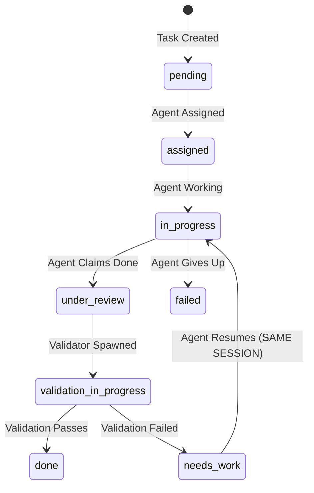

# Validation Agent System Documentation

## Overview

The Validation Agent System provides automated quality control for task completion in Hephaestus. It enables optional validation layers with specialized validator agents that verify task completion and provide iterative feedback to phase agents.

## Key Features

- **Automated Validation**: Validator agents automatically check task completion against defined criteria
- **Iterative Feedback**: Agents receive feedback and can improve their work through multiple iterations
- **Optional Configuration**: Validation can be enabled/disabled per phase
- **Git Integration**: Each validation attempt creates a commit for full traceability
- **Quality Metrics**: Track validation pass rates and iteration counts

## Prerequisites

- Worktree isolation system must be configured (see `docs/worktree-isolation-system.md`)
- Database must be initialized with validation tables
- Git repository must be configured

## Architecture

### State Machine

The validation system extends the task state machine with new states:



### Task States Reference

| State | Description | Next States |
|-------|-------------|------------|
| `pending` | Task created, awaiting assignment | `assigned` |
| `assigned` | Agent assigned to task | `in_progress` |
| `in_progress` | Agent actively working | `under_review`, `failed` |
| `under_review` | Agent claims done, awaiting validation | `validation_in_progress` |
| `validation_in_progress` | Validator agent checking work | `done`, `needs_work` |
| `needs_work` | Validation failed, agent must fix | `in_progress` |
| `done` | Task completed (with or without validation) | - |
| `failed` | Task failed or abandoned | - |

### Database Schema

#### ValidationReview Table
Stores validation review history for tasks:

```sql
CREATE TABLE validation_reviews (
    id TEXT PRIMARY KEY,
    task_id TEXT NOT NULL,
    validator_agent_id TEXT NOT NULL,
    iteration_number INTEGER NOT NULL,
    validation_passed BOOLEAN NOT NULL,
    feedback TEXT NOT NULL,
    evidence JSON,
    recommendations JSON,
    created_at TIMESTAMP DEFAULT CURRENT_TIMESTAMP,
    FOREIGN KEY (task_id) REFERENCES tasks(id),
    FOREIGN KEY (validator_agent_id) REFERENCES agents(id)
);
```

#### Task Model Extensions
Additional fields for validation:

- `review_done` (Boolean): Whether task passed validation
- `validation_enabled` (Boolean): Whether validation is required
- `validation_iteration` (Integer): Current iteration number
- `last_validation_feedback` (Text): Feedback from last validation

#### Agent Model Extensions
- `agent_type` (String): `phase`, `validator`, or `monitor`
- `kept_alive_for_validation` (Boolean): Whether agent is waiting for validation

## API Reference

### Validation Endpoints

#### `give_validation_review()`
Submit validation review for a task.

**Parameters:**
- `task_id` (str): ID of task being validated
- `validator_agent_id` (str): ID of validator agent
- `validation_passed` (bool): Whether validation passed
- `feedback` (str): Detailed feedback
- `evidence` (List[Dict]): Evidence supporting decision
- `recommendations` (List[str]): Follow-up task recommendations

**Returns:**
```json
{
    "status": "completed|needs_work",
    "message": "Status message",
    "iteration": 1
}
```

**Who can call:** Validator agents only

### Validation Functions

#### `spawn_validator_agent(task_id, commit_sha)`
Creates a validator agent for a task.

**Parameters:**
- `task_id`: Task to validate
- `commit_sha`: Git commit to examine

**Returns:** Validator agent ID

#### `send_feedback_to_agent(agent_id, feedback)`
Sends validation feedback to running agent via tmux.

**Parameters:**
- `agent_id`: Agent to receive feedback
- `feedback`: Feedback message
- `iteration`: Current iteration number

## Phase YAML Configuration

### Validation Section Schema

Add validation configuration to any phase YAML file:

```yaml
validation:
  enabled: true  # Optional, defaults to true if section exists

  criteria:
    - description: "Clear description of what to check"
      check_type: "validation_type"
      # Type-specific fields...
      evidence_required: true  # Optional

  validator_instructions: |
    Additional instructions for the validator agent.
    These provide context beyond the automated checks.
```

### Check Types Reference

#### file_exists
Verify that files exist:
```yaml
- description: "Source files exist"
  check_type: "file_exists"
  target: ["src/main.py", "src/app.py"]
```

#### file_contains
Check if files contain specific patterns:
```yaml
- description: "README has installation instructions"
  check_type: "file_contains"
  target: "README.md"
  pattern: ["Installation", "Setup", "Requirements"]
```

#### command_success
Verify command executes successfully:
```yaml
- description: "Application starts without errors"
  check_type: "command_success"
  command: "python main.py --version"
```

#### test_pass
Ensure tests pass:
```yaml
- description: "All unit tests pass"
  check_type: "test_pass"
  command: "pytest tests/"
```

#### manual_verification
Require manual validation by validator:
```yaml
- description: "Code follows best practices"
  check_type: "manual_verification"
  evidence_required: true
```

#### code_review
Review code in specific areas:
```yaml
- description: "Error handling is robust"
  check_type: "code_review"
  focus_areas: ["src/", "lib/"]
```

#### performance_metric
Check performance metrics:
```yaml
- description: "Response time under 100ms"
  check_type: "performance_metric"
  metric: "response_time"
  threshold: "100ms"
```

## Integration Guide

### For Agent Developers

Agents interact with validation through the standard task completion flow:

1. Work on task normally
2. Call `update_task_status(status="done")` when complete
3. If validation is enabled:
   - Agent stays alive and waits for feedback
   - If validation fails, agent receives feedback via tmux
   - Agent can fix issues and claim done again
4. Process repeats until validation passes or agent gives up

### For Phase Designers

Best practices for writing validation criteria:

1. **Be Specific**: Clear, measurable criteria
2. **Start Simple**: Begin with basic checks, add complexity later
3. **Balance Automation**: Mix automated and manual checks
4. **Provide Context**: Use `validator_instructions` for nuance
5. **Consider Iteration**: Design for iterative improvement

## Validation Flow Examples

### Single Iteration Success

```python
# 1. Agent completes task
update_task_status(task_id="task123", status="done")

# 2. System checks validation is enabled
# 3. Spawns validator agent
# 4. Validator checks all criteria
# 5. All checks pass

give_validation_review(
    task_id="task123",
    validation_passed=True,
    feedback="All criteria met successfully"
)

# 6. Task marked as done
# 7. Both agents terminated
```

### Multiple Iteration Flow

```python
# Iteration 1
update_task_status(task_id="task123", status="done")
# Validator finds issues
give_validation_review(
    validation_passed=False,
    feedback="Missing error handling in main.py"
)

# Agent receives feedback, fixes issues

# Iteration 2
update_task_status(task_id="task123", status="done")
# Validator checks again
give_validation_review(
    validation_passed=True,
    feedback="Error handling now implemented correctly"
)
```

## Configuration

### System Configuration

Configure validation behavior in `config.py`:

```python
VALIDATION_CONFIG = {
    "enabled_by_default": False,
    "max_iterations": 10,
    "iteration_timeout_minutes": 30,
    "validator_timeout_minutes": 10,
    "keep_failed_iterations": True,
    "auto_create_followups": True
}
```

### Per-Phase Settings

Disable validation for specific phase:
```yaml
validation:
  enabled: false
```

Minimal validation:
```yaml
validation:
  criteria:
    - description: "Code runs without errors"
      check_type: "manual_verification"
```

## Testing Validation

### Local Testing

Test validation configuration:

```python
# Create test task with validation
task = create_task(
    description="Test task",
    validation_enabled=True
)

# Simulate agent completion
update_task_status(task.id, status="done")

# Check validation triggered
assert task.status == "validation_in_progress"
```

### Mock Validator

Create mock validator for testing:

```python
mock_validator = Agent(
    agent_type="validator",
    system_prompt="Test validator"
)

# Submit review
give_validation_review(
    task_id=task.id,
    validator_agent_id=mock_validator.id,
    validation_passed=True,
    feedback="Test passed"
)
```

## Troubleshooting

### Agent Not Receiving Feedback

1. Check tmux session is alive:
   ```bash
   tmux list-sessions | grep agent_
   ```

2. Verify agent `kept_alive_for_validation` flag is True

3. Check logs for feedback delivery errors

### Validation Loops

If validation keeps failing:

1. Check iteration count hasn't exceeded maximum
2. Review validation criteria for conflicts
3. Examine feedback clarity
4. Consider manual intervention

### State Transition Issues

Debug state transitions:

```python
# Check current state
print(f"Task status: {task.status}")
print(f"Validation iteration: {task.validation_iteration}")
print(f"Last feedback: {task.last_validation_feedback}")
```

## Results System Integration

Validation affects result verification:

- **Verification Status**: Results marked as 'verified' after validation
- **Evidence Linking**: ValidationReview.id links to verified results
- **Trust Mechanism**: Only validated results receive 'verified' badge

Example:
```python
if task.review_done:
    result.verification_status = "verified"
    result.verified_by_validation_id = review.id
```

## Performance Considerations

- **Validation Overhead**: Adds 2-10 minutes per task
- **Iteration Cost**: Each iteration creates git commit
- **Storage Growth**: Multiple commits increase repository size
- **Compute Cost**: Validator agents consume resources

## Common Validation Patterns

### API Development
```yaml
validation:
  criteria:
    - description: "API endpoints respond"
      check_type: "command_success"
      command: "curl -f http://localhost:8000/health"

    - description: "OpenAPI spec exists"
      check_type: "file_exists"
      target: ["openapi.json", "swagger.yaml"]
```

### Documentation Tasks
```yaml
validation:
  criteria:
    - description: "README is comprehensive"
      check_type: "file_contains"
      target: "README.md"
      pattern: ["Installation", "Usage", "Contributing"]

    - description: "Examples work"
      check_type: "manual_verification"
```

### Testing Implementation
```yaml
validation:
  criteria:
    - description: "Tests exist"
      check_type: "file_exists"
      target: ["tests/", "test_*.py"]

    - description: "Tests pass"
      check_type: "test_pass"
      command: "pytest"

    - description: "Coverage acceptable"
      check_type: "command_success"
      command: "pytest --cov --cov-fail-under=80"
```

## Future Enhancements

Planned improvements:

1. **Smart Validation**: ML-based validation prediction
2. **Template Library**: Reusable validation templates
3. **Cross-Phase Validation**: Validate dependencies between phases
4. **Validation Analytics**: Detailed metrics and dashboards
5. **Auto-Fix Suggestions**: Validator provides code fixes

## Support

For issues or questions about the validation system:

1. Check this documentation
2. Review example workflows in `example_workflows/validated_project/`
3. Examine test cases in `tests/test_validation_system.py`
4. Contact the development team

## Appendix: Complete Example

Full phase YAML with comprehensive validation:

```yaml
description: |
  Implement core functionality with proper testing and documentation.

Done_Definitions:
  - Core features implemented
  - Tests written and passing
  - Documentation complete

validation:
  enabled: true

  criteria:
    - description: "Source code exists"
      check_type: "file_exists"
      target: ["src/main.py", "src/utils.py"]

    - description: "Tests are comprehensive"
      check_type: "test_pass"
      command: "pytest tests/ -v"
      evidence_required: true

    - description: "Code quality acceptable"
      check_type: "command_success"
      command: "flake8 src/ --max-complexity=10"

    - description: "Documentation present"
      check_type: "file_contains"
      target: "README.md"
      pattern: ["Installation", "Usage", "API"]

    - description: "Error handling robust"
      check_type: "code_review"
      focus_areas: ["src/"]
      evidence_required: true

  validator_instructions: |
    Ensure that:
    - All edge cases are handled
    - Code follows PEP 8 standards
    - Tests cover critical paths
    - Documentation is clear and complete

Additional_Notes: |
  This phase is critical. Take time to ensure quality.
```