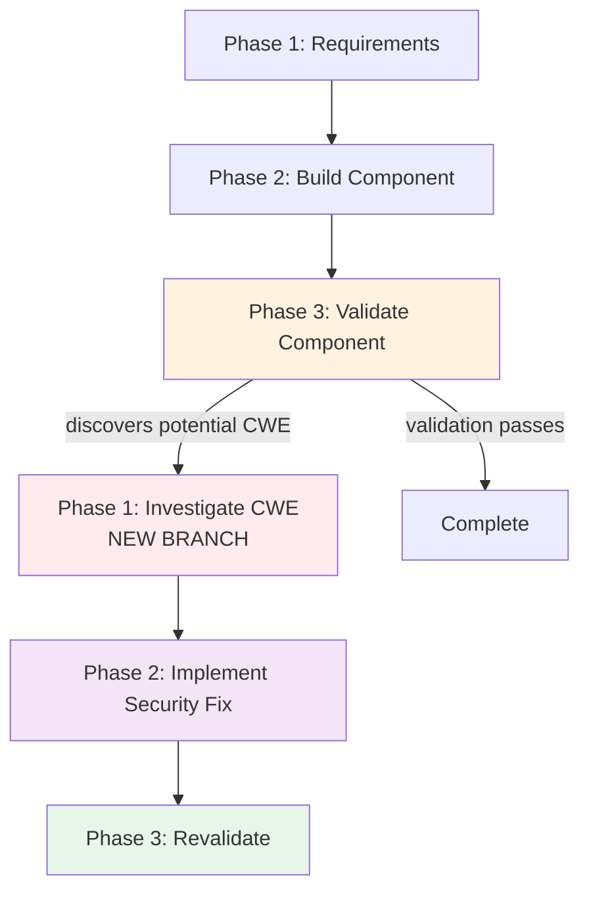
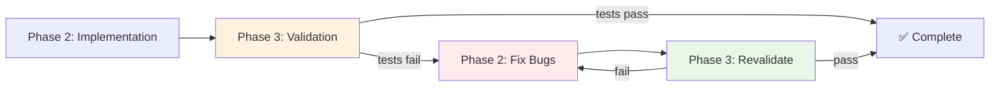
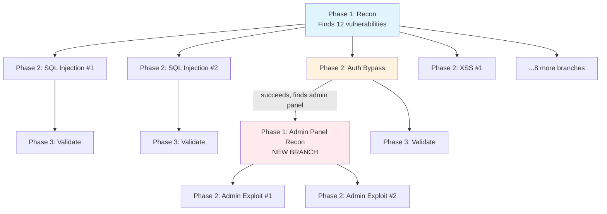
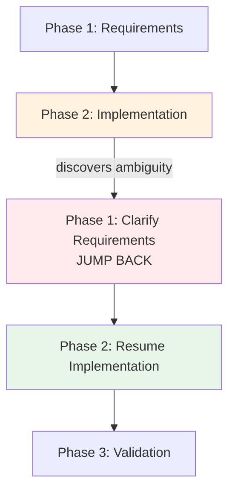
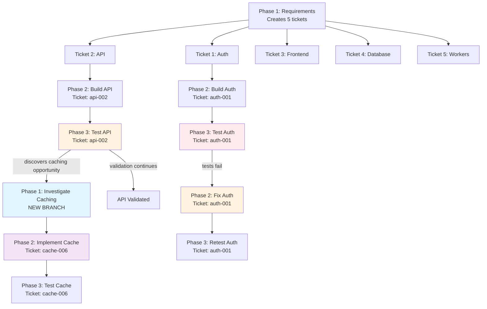

# Best Practices for Designing Workflows

The power of Hephaestus workflows comes from one thing: **interconnection**.

You define logical phases of problem-solving, then design how they communicate and branch. The workflow builds itself based on what agents discover at each phase.

This isn't about writing clear instructions (that's a given). It's about designing **interconnected problem-solving flows** that adapt to reality.

## Start With the Problem

Before defining phases, understand what you're actually solving.

**Bad approach:** "I need phases for reconnaissance, exploitation, and validation."

**Good approach:** "I'm hunting vulnerabilities in a web app. The logical flow is: map the attack surface → test potential vulnerabilities → validate exploits work → document findings. Each phase might spawn new work based on what it discovers."

The phases emerge from the problem structure, not the other way around.

### Ask These Questions

1. **What's the end goal?** (e.g., "Find and validate security vulnerabilities")
2. **What are the logical stages to reach it?** (e.g., recon → exploitation → validation → reporting)
3. **What might agents discover at each stage that requires different expertise?** (e.g., validation finds a potential RCE → needs deeper investigation)
4. **Where do phases need to loop back?** (e.g., validation fails → goes back to implementation)

The answers define your phase structure.

## Design for Interconnection

Phases don't work in isolation. They communicate, branch, and loop based on what agents discover.

Here are the interconnection patterns that work:

### Pattern 1: Use Kanban Boards for Cross-Phase Tracking

When you enable ticket tracking with a Kanban board, you get **semi-structured organization** across phases.

**Why this matters:**

Without tickets, each task is isolated. You lose context:
- What was decided about this component?
- What commits relate to this work?
- What's blocking progress?

With tickets, you get continuity across phases:
- **Comments** accumulate discussion and decisions
- **Commits** link to specific work items
- **Status transitions** show how work flows through phases
- **Blocking relationships** enforce dependencies

**Setup:**

```python
from src.sdk.models import WorkflowConfig

config = WorkflowConfig(
    has_result=True,
    enable_tickets=True,
    board_config={
        "columns": [
            {"id": "backlog", "name": "📋 Backlog"},
            {"id": "analyzing", "name": "🔍 Analyzing"},
            {"id": "building", "name": "🔨 Building"},
            {"id": "building-done", "name": "✅ Built"},
            {"id": "testing", "name": "🧪 Testing"},
            {"id": "done", "name": "🎉 Done"}
        ],
        "ticket_types": ["component", "bug", "investigation"]
    }
)
```

**Instruct agents to move tickets:**

```yaml
# Phase 2: Implementation
additional_notes: |
  STEP 1: Move your ticket to 'building' status
  change_ticket_status(ticket_id="ticket-xxx", new_status="building")

  [... do the work ...]

  STEP 7: Move ticket to 'building-done'
  change_ticket_status(ticket_id="ticket-xxx", new_status="building-done")

  STEP 8: Create Phase 3 validation task, pass the ticket along
  create_task({
      "description": "Phase 3: Validate [Component] - TICKET: ticket-xxx",
      "phase_id": 3
  })
```

Now the ticket moves through board columns as it progresses through phases. All context stays attached.

### Pattern 2: Branch on Discoveries

The most powerful interconnection pattern: **agents spawn new investigation branches when they discover something interesting**.

**Example: Validation Discovers a CWE**

```yaml
# Phase 3: Validation
additional_notes: |
  While testing, if you discover something that could be a security issue:
  - A potential CWE (Common Weakness Enumeration)
  - An unexpected behavior that might be exploitable
  - A design flaw

  SPAWN AN INVESTIGATION:

  create_task({
      "description": "Phase 1: Investigate Potential CWE - [What you found]",
      "phase_id": 1,  # Back to analysis phase
      "priority": "high"
  })

  Then CONTINUE your validation work. Don't stop to investigate yourself.
```

**The workflow branches:**



The validation agent found something, spawned an investigation branch, and kept validating. The workflow adapted to what was discovered.

### Pattern 3: Feedback Loops for Iteration

Sometimes phases need to loop back when work isn't complete.

**Example: Validation Fails**

```yaml
# Phase 3: Validation
additional_notes: |
  After running tests:

  If tests PASS:
  - Move ticket to 'done' status
  - Mark task complete

  If tests FAIL:
  - Create a Phase 2 bug fix task:
    create_task({
        "description": "Phase 2: Fix bugs in [Component] - [Specific errors]",
        "phase_id": 2,
        "priority": "high",
        "ticket_id": "ticket-xxx"  # Same ticket continues
    })
  - Mark your validation task as done (validation complete, just found issues)
```

**The feedback loop:**



Phases communicate through task creation. Validation finds issues → spawns fix task → fix implemented → spawns revalidation → loop until complete.

### Pattern 4: Parallel Branching for Exploration

In analysis or reconnaissance phases, you often discover multiple things worth exploring in parallel.

**Example: Parallel Component Building**

```yaml
# Phase 1: Requirements Analysis
additional_notes: |
  After analyzing the requirements, create Phase 2 implementation tasks
  for EACH component you identify:

  For each component:
  create_task({
      "description": "Phase 2: Build [Component Name]",
      "phase_id": 2,
      "priority": "high"
  })

  If you identify 10 components, spawn 10 Phase 2 tasks.
  They'll run in parallel.
```

**The parallel branches:**



One reconnaissance phase spawns 12 exploitation branches. One exploitation succeeds and spawns new reconnaissance. The workflow grows based on what's discovered.

### Pattern 5: Phase Jumping for Context Changes

Sometimes you discover something that needs a completely different phase type.

**Example: Implementation Discovers Missing Requirements**

```yaml
# Phase 2: Implementation
additional_notes: |
  If while implementing you realize:
  - Requirements are unclear
  - A design decision needs to be made
  - You need more analysis before proceeding

  JUMP BACK to Phase 1:

  create_task({
      "description": "Phase 1: Clarify [What's unclear] - Needed for [Component]",
      "phase_id": 1,
      "priority": "high"
  })

  Mark your implementation task as blocked and note what you're waiting for.
```

**The phase jump:**



Implementation realized it needed more analysis. Instead of guessing, it jumped back to Phase 1 for clarification.

## Interconnection Through Tickets

When you use ticket tracking, tickets become the **thread connecting phases**.

**Best practice: Pass tickets through phases**

```yaml
# Phase 1: Requirements Analysis
additional_notes: |
  For each component you identify, create a ticket:

  ticket_id = create_ticket(
      title="Build [Component Name]",
      description="[Requirements and context]",
      ticket_type="component"
  )

  Then create Phase 2 task with ticket link:
  create_task({
      "description": "Phase 2: Implement [Component] - TICKET: {ticket_id}",
      "phase_id": 2
  })
```

```yaml
# Phase 2: Implementation
additional_notes: |
  Extract ticket ID from your task description.

  Move ticket to 'building':
  change_ticket_status(ticket_id="ticket-xxx", new_status="building")

  [... do work ...]

  Move ticket to 'building-done':
  change_ticket_status(ticket_id="ticket-xxx", new_status="building-done")

  Pass ticket to Phase 3:
  create_task({
      "description": "Phase 3: Validate [Component] - TICKET: ticket-xxx",
      "phase_id": 3
  })
```

```yaml
# Phase 3: Validation
additional_notes: |
  Extract ticket ID from your task description.

  Move ticket to 'testing':
  change_ticket_status(ticket_id="ticket-xxx", new_status="testing")

  [... run tests ...]

  If passes:
  - Move ticket to 'done'
  - Mark task complete

  If fails:
  - Keep ticket in 'testing'
  - Create Phase 2 fix task with same ticket ID
```

**The result:** One ticket follows the component through all phases. All discussions, commits, and status changes are tracked on that ticket.

## Design Interconnected Done Definitions

Your done definitions should specify **what connections to create**:

**❌ Isolated:**
```yaml
done_definitions:
  - "Component implemented"
  - "Tests passing"
```

**✅ Interconnected:**
```yaml
done_definitions:
  - "Component implemented and committed"
  - "Tests passing (verified by test output)"
  - "Phase 3 validation task created with ticket link"
  - "Ticket moved to 'building-done' status"
  - "If discovered potential issues: investigation tasks created"
```

The done definitions enforce interconnection. Agents can't complete their phase without creating the next phase's work.

## Example: Interconnected Software Development Workflow

Here's what a well-designed interconnected workflow looks like:

### Phase Structure

```python
# Phase 1: Requirements Analysis
# - Reads PRD
# - Creates tickets for each component
# - Spawns Phase 2 tasks with ticket links

# Phase 2: Implementation
# - Moves ticket to 'building'
# - Implements component
# - Spawns Phase 3 validation with ticket link
# - If discovers optimization: spawns Phase 1 investigation

# Phase 3: Validation
# - Moves ticket to 'testing'
# - Runs tests
# - If passes: moves ticket to 'done'
# - If fails: spawns Phase 2 fix with ticket link
# - If discovers security issue: spawns Phase 1 investigation
```

### The Interconnection Flow



**What's happening:**
1. Phase 1 creates tickets for 5 components
2. Each component flows through Phase 2 → Phase 3 with ticket attached
3. Phase 3 (API) discovers optimization → spawns Phase 1 investigation → continues original work
4. Investigation leads to new Phase 2 implementation → Phase 3 validation
5. Phase 3 (Auth) fails validation → spawns Phase 2 fix → retests
6. All work tracked on Kanban board, all commits linked to tickets

This is interconnected workflow design.

## Common Interconnection Patterns

### Analysis → Implementation → Validation → Documentation
**Used in:** Software development, system building

**Interconnection:**
- Analysis spawns multiple implementation branches
- Successful implementation spawns validation
- Validation spawns documentation
- Implementation can spawn new analysis if new requirements found

### Analysis → Design → Implementation → Testing → Deployment
**Used in:** Software development

**Interconnection:**
- Analysis creates tickets, spawns design tasks
- Design spawns parallel implementation tasks
- Implementation spawns testing
- Testing failures loop back to implementation
- Testing discoveries spawn new analysis

### Investigation → Hypothesis → Experiment → Analysis → Report
**Used in:** Research, problem-solving

**Interconnection:**
- Investigation spawns multiple hypothesis branches
- Each hypothesis spawns experiment
- Experiments spawn analysis
- Analysis can spawn new investigations if findings unexpected

## The Key Insight

**Workflows aren't linear.** They're interconnected graphs where:
- Phases spawn new phases based on discoveries
- Tickets thread context through multiple phases
- Feedback loops iterate until success
- Parallel branches explore multiple paths
- Phases jump when context changes

Design for this interconnection from the start. Don't just define phases—design how they **communicate and branch**.

That's what makes workflows powerful.

## Testing Your Workflow Design

Before implementing, test the interconnection:

### The Discovery Test

"What might agents discover at each phase that requires different expertise?"
- Phase 1 might find ambiguities → spawn clarification tasks
- Phase 2 might find optimizations → spawn investigation tasks
- Phase 3 might find bugs → spawn fix tasks

### The Ticket Thread Test

"Can I follow one piece of work through all phases via its ticket?"
- Does the ticket move through board columns?
- Are commits linked to the ticket?
- Do comments capture decisions?

### The Branch Test

"Where should the workflow branch based on findings?"
- Reconnaissance finding 10 vulnerabilities → 10 branches
- Validation discovering security issue → investigation branch
- Implementation finding missing requirements → analysis branch

If you can't answer these, your workflow isn't interconnected enough.

## The Bottom Line

Great workflows are **interconnected problem-solving flows**:
- Phases are logical stages of reaching a solution
- Kanban boards track work across phases
- Tickets thread context through multiple phases
- Phases spawn new work based on discoveries
- Feedback loops iterate until success
- The workflow structure emerges from what agents find

Design the interconnection patterns upfront. The workflow will build itself based on the problem.

---

## Related Documentation

- [Phases System Overview](phases-system.md) - How phases work and branch dynamically
- [Guardian Integration](guardian-integration.md) - How monitoring uses phase context
- [Ticket Tracking](ticket-tracking.md) - Deep dive into Kanban coordination
- [Quick Start Guide](quick-start.md) - Build your first workflow in 10 minutes
