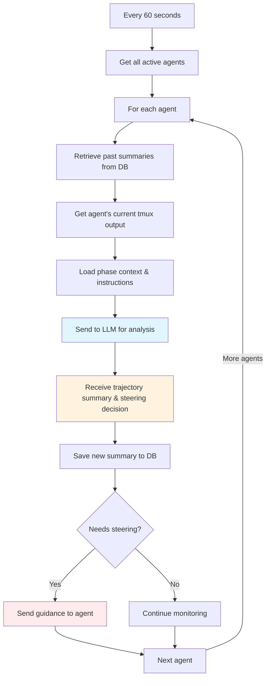

# Guardian: Keeping Agents On Track

Here's the thing about AI agents: they're brilliant at focused work, but they drift. They get stuck in loops. They forget mandatory steps. They work on the wrong things.

That's where Guardian comes in.

## What Guardian Actually Does

Every 60 seconds, Guardian wakes up and checks every active agent in your workflow. But it's not a simple health check — it's **trajectory analysis**.

Guardian asks:
- Is this agent working toward their actual goal?
- Did they miss any mandatory steps from the phase instructions?
- Are they stuck in an error loop?
- Did they drift to unrelated work?
- Are they violating constraints from earlier in the conversation?

Then Guardian makes a decision: continue watching, or intervene with targeted guidance.

The best part? Guardian remembers everything. Constraints don't disappear just because they were mentioned 20 minutes ago. If you said "no external libraries" at the start of the workflow, Guardian will enforce that throughout the entire session — even if the agent forgets.

## How It Works: Building Context

Here's where it gets interesting. Guardian doesn't just look at what the agent is doing right now. It builds **accumulated context** from the entire conversation history.

Every 60 seconds, Guardian:

1. **Retrieves past summaries** from the database
   - "15 minutes ago: Agent exploring auth patterns"
   - "10 minutes ago: Started JWT implementation"
   - "5 minutes ago: Writing token validation logic"

2. **Captures current state** from the agent's tmux output
   - What files are they working on?
   - What commands did they run?
   - Are there error messages?

3. **Loads phase context** from your phase definitions
   - What are the mandatory steps?
   - What are the done definitions?
   - What constraints were specified?

4. **Sends everything to an LLM** (configurable — we recommend `gpt-oss:120b` via OpenRouter with Cerebras provider for speed and cost)

5. **Saves a new summary** of what the agent accomplished this cycle

The summaries create a timeline. Guardian can see the agent's entire journey, not just the current moment.

Here's what the actual trajectory summaries look like in the UI:


Each entry shows:
- **Timestamp** - When the summary was created
- **Alignment Score** - How well aligned the agent is with goals (96%, 95%, 93%)
- **Summary** - What the agent accomplished in that cycle

These summaries build the context Guardian uses to understand the agent's trajectory.

## Trajectory Thinking

This accumulated context is what enables **trajectory thinking**.

When Guardian analyzes an agent working on authentication, it knows:

**Overall Goal**: Build JWT authentication system
**Session Duration**: 45 minutes
**Active Constraints**:
- "No external auth libraries" (said 20 minutes ago, **still applies**)
- "Must use built-in crypto module"

**Standing Instructions**:
- "Always write tests for new functions"
- "Include error handling"

**Past Progress** (from summaries):
- Explored existing auth code
- Started implementing token generation
- Hit an error loading JWT secret from config
- Currently debugging the secret loading issue

Guardian tracks everything. Constraints persist until explicitly lifted. Instructions from the start of the session remain active. The agent's history informs whether their current action makes sense.

If the agent tries to install `jsonwebtoken` package, Guardian catches it immediately: "You're violating the 'no external auth libraries' constraint from 20 minutes ago. Use Node.js built-in crypto module instead."

## What Guardian Checks

Your **phase instructions become Guardian's validation rules**.

When you write:
```yaml
additional_notes: |
  ⚠️ MANDATORY: Search for existing tickets before creating new ones

  STEP 1: Call search_tickets(query="...", search_type="hybrid")
  STEP 2: Review results
  STEP 3: Only create if no duplicate found
```

Guardian validates: "Did the agent search before creating?"

If the agent skips the search and creates a ticket directly, Guardian intervenes with the phase instructions and reminds them what they missed.

## When Guardian Intervenes

Guardian detects several steering situations:

**Stuck** — Same error appearing 5+ times
```
You've hit the JWT secret error 6 times now. The issue is line 47 where you
initialize the validator. Check your environment variable loading in config.js.
```

**Drifting** — Working on unrelated areas
```
You're working on the database schema, but your Phase 2 task is to implement
authentication. Please return to implementing the auth system.
```

**Violating Constraints** — Breaking rules from earlier in the conversation
```
You're installing 'bcrypt', but Phase 2 instructions mandate "No external
libraries." Use Node.js crypto.pbkdf2() for password hashing.
```

**Idle** — Agent finished but hasn't updated status
```
You've completed the implementation. Tests are passing. Please call
update_task_status with status='done' and provide a summary.
```

**Missed Steps** — Agent skipped mandatory phase instructions
```
Phase instructions require: search_tickets() before creating new tickets.
You created a ticket without searching. Please search now to avoid duplicates.
```

## Guardian in Action

Let's watch Guardian monitor an agent building JWT authentication:

**Cycle 1** (00:00) — Starting well
```
trajectory_summary: "Agent reading auth-related files to understand structure"
alignment_score: 0.9
needs_steering: false
```

**Cycle 2** (01:00) — Making progress
```
trajectory_summary: "Implementing JWT token generation with HS256, following
no-external-libs constraint"
alignment_score: 0.85
needs_steering: false
```

**Cycle 3** (02:00) — Problem detected!
```
trajectory_summary: "Installing 'jsonwebtoken' package — VIOLATES constraint
from Phase 1: 'no external auth libraries'"
alignment_score: 0.4
needs_steering: true
steering_type: "violating_constraints"

Guardian sends intervention: "You're trying to install 'jsonwebtoken' package,
but the constraint from Phase 1 says 'no external auth libraries'. Use Node.js
built-in crypto module instead."
```

**Cycle 4** (03:00) — Back on track
```
trajectory_summary: "Agent switched to built-in crypto after steering, now
implementing token generation correctly"
alignment_score: 0.9
needs_steering: false
```

**Cycle 5** (04:00) — Completion reminder
```
trajectory_summary: "Implementation complete and verified, but agent idle
without updating status"
needs_steering: true
steering_type: "idle"

Guardian sends reminder: "You've completed JWT implementation and tests are
passing. Please update task status to 'done' with update_task_status tool."
```

Guardian caught the violation, corrected the agent's approach, then ensured proper completion. All automatically.

Here's what this looks like visually in the alignment graph:


The graph shows:
- **Blue line** - Agent's alignment score over time (0-100%)
- **Stars** - Phase changes (when agent transitions between phases)
- **Dips** - Moments when agent went off track and Guardian intervened
- **Recovery** - Agent returning to high alignment after steering

Notice how the alignment stays high (>80%) most of the time, dips when the agent violates constraints or gets stuck, then recovers after Guardian's intervention. This is trajectory monitoring in action.

## The Monitoring Loop



Every agent gets analyzed. Every agent gets full trajectory context. Every agent gets intelligent steering when needed.

## LLM Configuration

Guardian's LLM is **configurable**. We recommend:

**`gpt-oss:120b` via OpenRouter with Cerebras provider** — Extremely fast (1000+ tokens/sec), cost-effective, great reasoning

You can also use:
- OpenAI GPT-4
- Anthropic Claude
- Any model that supports structured analysis

The key is speed — Guardian runs every 60 seconds for every active agent, so fast inference matters. Cerebras provides exceptional speed through OpenRouter.

## The Result: Self-Healing Workflows

Guardian creates workflows that correct themselves:

**Without Guardian:**
- Agent drifts off-task → wasted work
- Agent forgets mandatory steps → incomplete work
- Agent violates constraints → wrong implementation
- Agent gets stuck → workflow stalls

**With Guardian:**
- Agent drifts → redirected immediately
- Agent forgets steps → reminded of requirements
- Agent violates constraints → intervention with context
- Agent gets stuck → targeted help to overcome blocker

The workflow heals itself based on what agents are actually doing.

## Design for Guardian

Guardian works best with clear, specific phase instructions:

✅ **Mark mandatory steps explicitly:**
```yaml
additional_notes: |
  ⚠️ MANDATORY:
  1. Search for existing tickets first
  2. Include "TICKET: ticket-xxx" in descriptions
  3. Call update_task_status when done
```

✅ **Use measurable done definitions:**
```yaml
done_definitions:
  - "auth.js created with generateToken() function"
  - "auth.test.js exists with 5+ test cases"
  - "update_task_status called"
```

✅ **Acknowledge long operations:**
```yaml
additional_notes: |
  STEP 5: Run test suite (takes 3-5 minutes - this is normal!)
```

Guardian reads your phase instructions and uses them as validation criteria. The clearer your instructions, the better Guardian can keep agents on track.

---

## Related Documentation

- [Phases System](phases-system.md) - How phases work and branch dynamically
- [Best Practices](best-practices.md) - Designing interconnected workflows
- [Quick Start Guide](quick-start.md) - Build your first workflow in 10 minutes
