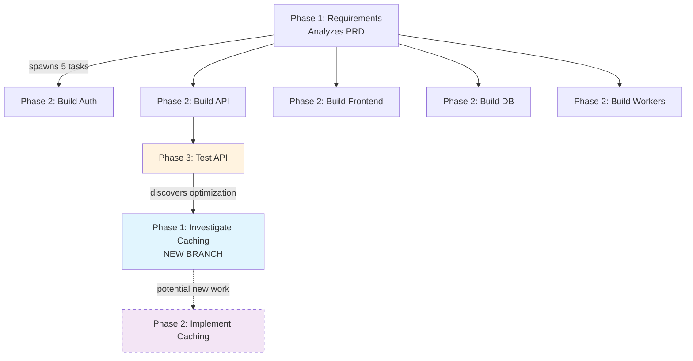
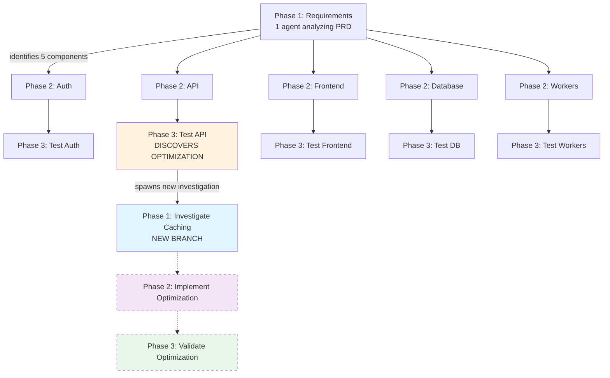
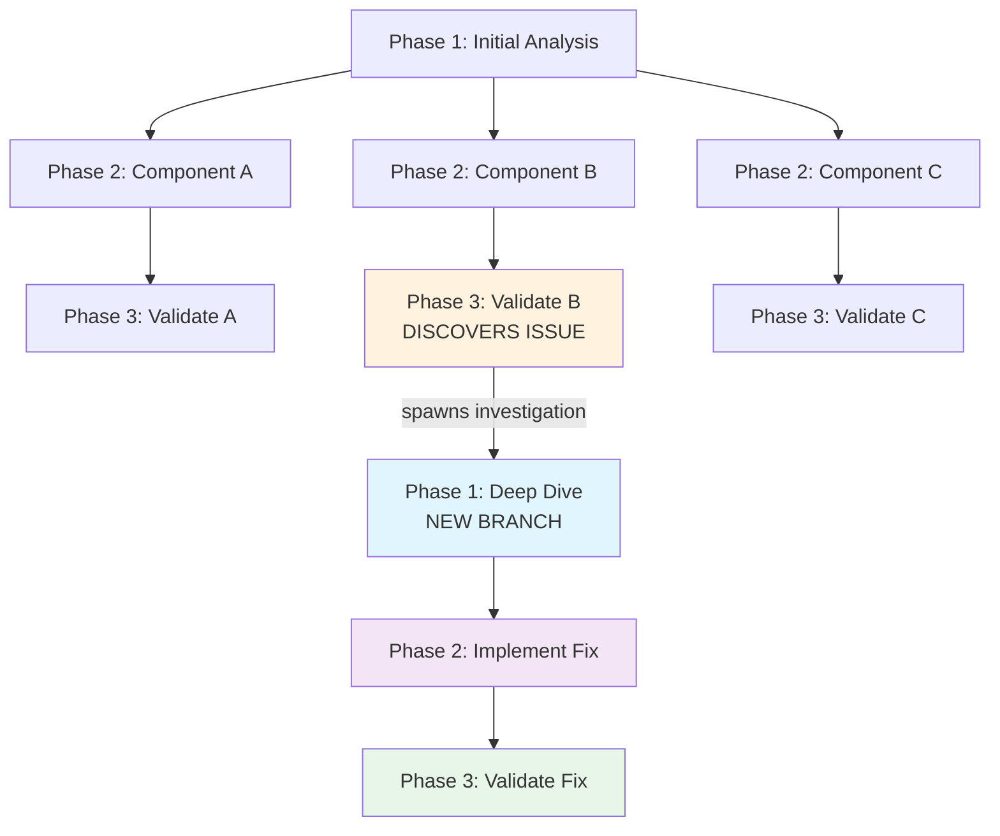

# Understanding the Phases System

Here's the thing about AI agents: they're really good at focused tasks. Ask an agent to "build a login system," and it'll do great work. But ask it to "build an entire application," and things get messy. The agent loses context, forgets requirements, and tries to do everything at once.

So we built something different. Something that lets workflows **build themselves** as agents discover what needs to be done.

## What Actually Happens

Imagine you tell Hephaestus: "Build me a web app from this PRD."

A traditional system would spawn one agent to handle everything. That agent would get overwhelmed, lose track of requirements, and probably mess something up.

Here's what Hephaestus does instead:

**Phase 1 agent** reads your PRD and thinks: "Okay, I see 5 major components here: auth system, REST API, frontend, database, and background workers."

It spawns **5 Phase 2 agents** — one for each component. Each agent has one job: build their component.

Those 5 agents work in parallel. When each finishes, they spawn **Phase 3 validation agents** to test what they built.

But here's where it gets interesting.

One of those Phase 3 agents is testing the REST API. While running integration tests, it notices something: the authentication endpoints are using a clever caching pattern that could speed up the entire API by 40%.

**That's worth investigating.**

So the Phase 3 agent does something unexpected — it spawns a **new Phase 1 investigation task**: "Analyze this caching pattern and see if we can use it elsewhere."

Meanwhile, the Phase 3 agent **keeps working** on its original task. It doesn't stop. It found something interesting, created a task to explore it, and moved on.

Now you have a new branch growing from the middle of your workflow:



The workflow just **adapted itself** based on what an agent discovered. No one told it to investigate caching. The agent found something interesting and spawned new work to explore it.

This is the core idea: **workflows that build themselves based on what agents find.**

## What Are Phases, Really?

Phases aren't a rigid pipeline. They're more like **job descriptions** for different types of work.

Think of it like departments in a company:
- **Phase 1 (Analysis)** = The product team figuring out what to build
- **Phase 2 (Building)** = Engineering actually building it
- **Phase 3 (Validation)** = QA making sure it works

Each phase gives agents:
- **A clear role** — What type of work is this?
- **Specific instructions** — How should I approach it?
- **Success criteria** — When am I done?
- **The freedom to spawn new work** — In any phase, based on what they discover

The last part is critical. Agents aren't locked into a linear flow. If a Phase 3 agent discovers something that needs Phase 1 analysis, it can spawn that work immediately.

Here's what phases look like in the Hephaestus UI:


Each phase shows:
- **Phase number and name** - Clear identification of the phase type
- **Active status** - Which phases currently have running agents
- **Task counts** - Total tasks, completed tasks, and active tasks per phase
- **Agent activity** - How many agents are currently working in this phase

In this workflow, Phase 2 is active with 2 agents working on implementation tasks. Phase 1 has completed 1 task (requirements analysis), and Phase 2 has completed 22 out of 28 tasks.

## How a Phase is Built

Every phase has 5 key components. Let me show you what they actually look like:

### 1. Identity & Description
```python
id=2,
name="implementation",
description="Implement one component with comprehensive tests"
```
This tells agents: "You're in Phase 2. Your job is implementation, not planning or testing."

### 2. Done Definitions
```python
done_definitions=[
    "Component code files created",
    "Minimum 3 test cases passing",
    "Phase 3 testing task created",
    "update_task_status called with status='done'"
]
```
These aren't vague goals like "finish the feature." They're **concrete, checkable outcomes**. Either the files exist or they don't. Either the tests pass or they fail.

### 3. Additional Notes (The System Prompt)
```yaml
additional_notes: |
  YOU ARE A SOFTWARE ENGINEER

  STEP 1: Understand what you're building
  STEP 2: Design the component interface
  STEP 3: Implement the code
  STEP 4: Write tests (minimum 3 cases)
  STEP 5: Run tests and verify they pass
  STEP 6: Create Phase 3 testing task
  STEP 7: Mark your task as done
```
This is where you tell agents **exactly how to think**. It's the phase's system prompt. The more specific you are here, the better agents perform.

### 4. Expected Outputs
```python
outputs=[
    "Component code in src/ directory",
    "Test file with passing tests"
]
```
What artifacts should exist when this phase completes?

### 5. What Happens Next
```python
next_steps=[
    "Phase 3 agent will run integration tests",
    "If tests pass, component is validated"
]
```
Helps agents understand the bigger picture. They're not working in isolation.

## Example 1: Building Software That Discovers Itself

Let me walk you through a real workflow. You give Hephaestus a PRD and say: "Build this."

### The Setup

You define three phase types:

**Phase 1: Requirements Analysis**
- Read the PRD
- Identify system components
- Spawn Phase 2 tasks for each component

**Phase 2: Implementation**
- Build one component
- Write tests
- Spawn Phase 3 validation task

**Phase 3: Validation**
- Test the component
- Verify it meets requirements
- Mark as complete

### What Actually Happens

You start with one task: "Phase 1: Analyze PRD.md"

The Phase 1 agent reads your document and identifies 5 components:
1. Authentication system
2. REST API
3. Frontend UI
4. Database schema
5. Background workers

It spawns **5 Phase 2 tasks** — one per component. Now you have 5 agents building in parallel:

- **Agent A**: Building authentication
- **Agent B**: Building REST API
- **Agent C**: Building frontend
- **Agent D**: Building database
- **Agent E**: Building workers

Each Phase 2 agent finishes and spawns its own Phase 3 validation task. Now you have **5 Phase 3 agents** testing each component.

### The Branching Moment

Here's where workflows get interesting.

**Phase 3 Agent B** is testing the REST API. While running integration tests, it notices the auth endpoints use a clever caching pattern that improves response times significantly.

This is worth investigating.

Agent B spawns a **new Phase 1 task**: "Investigate caching pattern in auth endpoints — could optimize other API routes."

But here's the key: **Agent B doesn't stop working**. It discovered something interesting, created a task to explore it, and kept validating the REST API.

Now you have this structure:



The new Phase 1 agent investigates the caching pattern. It determines this could improve performance by 40% across all API routes. It spawns a Phase 2 implementation task.

A new agent implements the caching optimization.

**The workflow built itself.** You didn't plan for this caching optimization upfront. An agent discovered it during testing and spawned new work to implement it.

Here's what the actual tasks look like when assigned to phases:


Each task shows:
- **Phase badge** - Blue tag showing which phase it belongs to (P2 Plan And Implementation, P3 Validate And Document)
- **Task description** - What the agent needs to accomplish
- **Status** - Whether it's done, assigned, or in progress
- **Priority** - High, medium, or low
- **Agent assignment** - Which agent is working on it
- **Timestamp** - When the task was created

Notice how tasks from different phases appear in the list — Phase 2 implementation tasks and Phase 3 validation tasks running in parallel. Some Phase 3 agents discovered critical issues and spawned new Phase 2 bug-fix tasks (see "Fix CRITICAL Analytics service integration issues").

## How Phases Enable Adaptive Workflows

## The Core Insight

Here's what makes this powerful: **you define the types of work, not the specific work to do.**

Traditional workflow systems say: "Do step 1, then step 2, then step 3." If reality doesn't match your plan, the workflow breaks.

Phase-based workflows say: "Here are the types of work you can do (analysis, building, testing). Figure out what specific work needs to happen based on what you discover."

### How It Works

1. **Agents work on specific phase types** with clear instructions
2. **During their work, they discover things** that need different expertise
3. **They spawn tasks for any phase** based on what they find
4. **Multiple branches run in parallel**
5. **The workflow structure emerges** from the problem itself

### Why This Matters

Building software? Your validation agent finds an optimization → spawns investigation → new feature emerges

Analyzing systems? Your investigation agent finds a deeper issue → spawns new analysis → problem space expands

Solving problems? Any agent can say "this needs different expertise" → spawns appropriate phase → workflow adapts

You get a **branching tree of specialized agents**, where each branch is working on a specific piece of the problem:



The structure wasn't predefined. It emerged from what agents discovered.

Here's what the actual workflow graph looks like in Hephaestus:


This graph shows the complete flow of agents and tasks through phases:

- **Left column (External Agents)** - MCP agents that initiate workflows
- **Phase 1 (Green)** - Requirements Analysis tasks
- **Phase 2 (Blue)** - Plan And Implementation tasks
- **Phase 3 (Orange)** - Validate And Document tasks

The colored lines show which agent/task created which task:
- **Purple lines** - Creation relationships (this agent spawned that task)
- **Green lines** - Assignment relationships (this agent is assigned to that task)

Notice the complex web of connections — agents in Phase 3 discovering issues and spawning Phase 2 bug-fix tasks, Phase 2 agents completing work and spawning Phase 3 validation tasks, and even some tasks looping back to earlier phases for investigation. This is the self-building workflow in action, with 108 nodes and 99 edges showing how work propagates across phases.

## How to Configure Phases

You can define phases two ways, depending on your needs:

### Python Objects (Dynamic Workflows)

```python
from src.sdk.models import Phase

PHASE_1_REQUIREMENTS = Phase(
    id=1,
    name="requirements_analysis",
    description="Extract requirements from PRD",
    done_definitions=[
        "Requirements extracted",
        "Components identified",
        "Phase 2 tasks created"
    ],
    working_directory=".",
    additional_notes="Read PRD.md and identify system components..."
)
```

Use this when you're generating workflows programmatically or need dynamic phase creation.

### YAML Files (Static Workflows)

**File: `01_requirements_analysis.yaml`**
```yaml
description: "Extract requirements from PRD"

Done_Definitions:
  - "Requirements extracted and documented"
  - "Components identified"
  - "Phase 2 tasks created for each component"

working_directory: "."

Additional_Notes: |
  Read the PRD file and extract all requirements.
  Identify the system components.
  Create one Phase 2 task per component.
```

**File: `phases_config.yaml`**
```yaml
name: "Software Builder"
description: "Build software from requirements"
has_result: true
result_criteria: "All components implemented and tested"
on_result_found: "stop_all"
```

Use YAML when you want version-controlled, reusable workflows that teams can share.

## Integration with Other Systems

Phases don't work in isolation. They integrate with the rest of Hephaestus:

### Guardian Monitoring

Guardian watches agents every 60 seconds using your phase definitions. If an agent drifts from the phase instructions, Guardian sends targeted corrections.

The phase instructions you write become Guardian's validation criteria. Write clear instructions, get better monitoring.

[Learn more: Guardian Integration](guardian-integration.md)

### Ticket Tracking

You can map phases to Kanban board columns. Tasks move through "Backlog → Building → Testing → Done" as they progress through phases.

Useful for visualizing workflow progress and tracking dependencies between agents.

[Learn more: Ticket Tracking](ticket-tracking.md)

### Validation Agents

Add automated validation when phase tasks complete:

```python
Phase(
    id=3,
    name="testing",
    validation={
        "enabled": True,
        "criteria": [
            {"description": "Tests pass", "check_type": "manual_verification"}
        ]
    }
)
```

A separate validation agent reviews the work before marking it complete.

### Memory System (RAG)

Agents can save discoveries and search past learnings:

```python
# Agent discovers something useful
save_memory(
    content="Auth pattern: Use JWT with 15min expiry",
    memory_type="discovery"
)

# Different agent in different workflow finds it later
results = qdrant_find(query="JWT authentication pattern")
```

Knowledge transfers between workflows automatically.

## Key Takeaways

**Phases are specialized instruction sets** for different types of work.

**Agents can spawn tasks for any phase** based on what they discover during execution.

**Workflows build themselves** — the structure emerges from the problem, not a predefined plan.

**Done definitions matter** — concrete, measurable outcomes keep agents on track.

**The branching tree structure** adapts to what agents find, creating dynamic exploration.

## What's Next?

Want to build your first workflow? Start here:
- [Quick Start Guide](quick-start.md) - Build a 3-phase workflow in 10 minutes

Want to design better phases? Read this:
- [Best Practices](best-practices.md) - Guidelines for writing effective phase instructions

Want deeper integration? Check these out:
- [Guardian Integration](guardian-integration.md) - How monitoring uses phases
- [Ticket Tracking](ticket-tracking.md) - Visual workflow coordination

The best projects are the ones that adapt to reality. That's what phases enable: workflows that discover themselves as they work.
