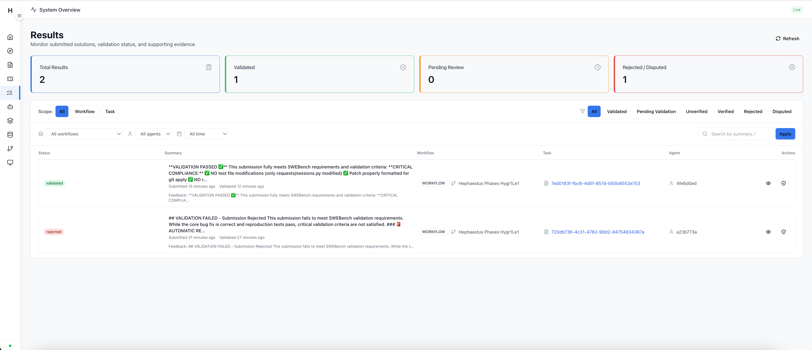

# Running SWEBench-Verified Benchmark

Help us evaluate Hephaestus on the SWEBench-Verified benchmark! This guide explains how community contributors can run benchmark instances and contribute results.

## 🎯 Overview

We're running a large-scale evaluation of Hephaestus on the [SWEBench-Verified](https://huggingface.co/datasets/princeton-nlp/SWE-bench_Verified) benchmark, which contains real-world GitHub issues from popular Python repositories. **We need your help to complete this evaluation!**

**Your contributions will be credited in our final report.** ✨

## 📋 Prerequisites

### Required
- **Claude Code Subscription** - You'll need an active Claude Code subscription (Sonnet-4.5)
  - This is the AI agent that will solve the issues
  - **IMPORTANT:** You must use **Claude Sonnet-4.5** (not older models)
- **Docker** (for Qdrant vector database)

### Provided by Us
- **OpenRouter API Key** - We'll provide you with an API key for gpt-oss access
  - This is used for the orchestration system
  - Keys will be distributed via Discord

## 🚀 Getting Started

### 1. Join Discord for Coordination

Join our Discord channel to coordinate instance assignments and avoid duplicates:

**Discord:** https://discord.gg/FMCJeKG3dU

- Announce which instances you're planning to run
- Get your OpenRouter API key
- Ask questions and get support
- Share your progress

### 2. Setup Hephaestus

Follow the [Getting Started Guide](../getting-started/quick-start.md) to:
- Clone the repository
- Install dependencies
- Start required services (Qdrant, MCP server, monitoring)

**Additional requirement:** Install the datasets library for instance generation:
```bash
pip install datasets
```

## 🎲 Generating Your Instance Batch

### 1. Generate Instances to Run

Use the provided script to generate a list of uncompleted instances:

```bash
# Generate 10 instances to run
python generate_instances.py --count 10

# Or generate more instances
python generate_instances.py --count 20
```

This script will:
- Fetch the SWEBench-Verified dataset (cached after first run)
- Check which instances are already completed in `swebench_results/`
- Generate an `instances.yaml` file with N uncompleted instances

### 2. Review Your Assigned Instances

The script will output the instances it selected. **Announce these in Discord** to avoid duplicates!

Example output:
```
[Success] Created instances.yaml with 10 instances:

[Info] Selected instances:
  1. django__django-13109
  2. psf__requests-1921
  3. astropy__astropy-7166
  ...
```

## 🏃 Running the Benchmark

### Start the Batch Run

Run your instances with the batch runner:

```bash
python run_swebench_batch.py \
    --instances instances.yaml \
    --timeout 3000 \
    --poll-interval 30
```

**Parameters:**
- `--instances`: Your generated YAML file
- `--timeout`: Max time per instance in seconds (3000s = 50 minutes)
- `--poll-interval`: How often to check for results (30s recommended)

### What Happens During the Run

The batch runner will:
1. Process each instance sequentially
2. Create a unique workspace for each instance
3. Run the Hephaestus workflow to solve the issue
4. Monitor for validated results via API polling
5. Collect solution patches and logs
6. Clean up between instances

### Monitor Progress

You'll see output like:
```
======================================================================
INSTANCE 1/10: django__django-13109
======================================================================

[Workflow] Starting: django__django-13109
[Workflow] Workspace: /tmp/swebench_django__django-13109_abc123

[Monitor] Starting to monitor for validated result...
[Monitor] Polling interval: 30s
[Monitor] Timeout: 3000s

[Poll] No validated result yet. Waiting 30s... (timeout in 2970s)
...

[Result] ✅ Found validated result!
[Collect] ✅ Results collected successfully
```

### Expected Runtime

- The system has a timeout of 50 minutes per instance (configurable)
- Some instances may complete faster, others may take the full timeout
- Runtime varies significantly based on issue complexity

**Tip:** Run batches overnight or during times when you won't need your machine.

### Watch Hephaestus in Action

Want to see what's happening under the hood? You can spin up the frontend to watch Hephaestus solve SWEBench problems in real-time!

```bash
# In a new terminal, start the frontend
cd frontend
npm install
npm run dev
```

Then open your browser to `http://localhost:5173` to access the Hephaestus dashboard. You'll be able to:
- Monitor task progress and agent activity
- View submitted solutions and validation results
- Track which instances are being solved
- See detailed execution logs



## 📦 Results Collection

### What Gets Saved

Results are saved to `swebench_results/<instance_id>/`:
- `solution.patch` - The generated fix
- `hephaestus.db` - Complete execution logs
- `metadata.json` - Timing and status information
- `result_metadata.json` - Detailed result data

### Submitting Your Results

Once your batch completes, **submit your results via a Pull Request** so your name gets credited properly!

1. **Create a new branch:**
   ```bash
   git checkout -b swebench-results-yourname
   ```

2. **Commit your results:**
   ```bash
   git add swebench_results/
   git commit -m "Add SWEBench results - [Your Name] - [Instance Count] instances"
   ```

3. **Push your branch:**
   ```bash
   git push origin swebench-results-yourname
   ```

4. **Create a Pull Request:**
   - Go to the GitHub repository
   - Create a PR from your branch to main
   - Title: "SWEBench Results - [Your Name] - [Instance Count] instances"
   - In the description, include:
     - List of instances you ran
     - Any issues or interesting findings
     - Your preferred name/username for credit

5. **Announce in Discord:**
   - Let everyone know you've submitted a PR
   - Share the PR link
   - Report any instances that failed or had issues

**This ensures your contribution is properly tracked and you get credited in the final report!** 🎖️

## 📊 Tracking Progress

### Check Completed Instances

```bash
# List completed instances
ls swebench_results/

# Count completed instances
ls swebench_results/ | wc -l
```

### View Batch Statistics

The batch runner shows final statistics:
```
======================================================================
BATCH RUN COMPLETE
======================================================================

Total instances: 10
Completed:       8 (80.0%)
Failed:          2 (20.0%)

Results saved to: ./swebench_results
```

## ⚠️ Troubleshooting

### Common Issues

**Issue: "datasets library not found"**
```bash
pip install datasets
```

**Issue: "Cannot connect to Qdrant"**
```bash
# Make sure Docker is running
docker ps | grep qdrant

# Restart Qdrant if needed
docker run -d -p 6333:6333 qdrant/qdrant
```

**Issue: "API key not found"**
- Check your `.env` file exists and has correct keys
- Make sure you sourced the environment variables

**Issue: Instance taking too long**
- The system has a timeout (50 minutes default)
- Some instances are genuinely harder - this is normal
- Failed instances will be marked in the final stats

### Getting Help

- **Discord:** https://discord.gg/FMCJeKG3dU - Ask questions, get support
- **GitHub Issues:** Report bugs or problems
- **Documentation:** See other guides in `website/docs/guides/`

## 🎖️ Recognition

**All contributors will be credited in our final SWEBench evaluation report!**

We'll acknowledge:
- Your name/username
- Number of instances you ran
- Any special contributions or findings

Thank you for helping advance autonomous AI agent research! 🚀

## 📚 Additional Resources

- [SWEBench-Verified Dataset](https://huggingface.co/datasets/princeton-nlp/SWE-bench_Verified)
- [SWEBench Paper](https://arxiv.org/abs/2310.06770)
- [Hephaestus Documentation](../)
- [Discord Community](https://discord.gg/FMCJeKG3dU)

## 🔄 Running Multiple Batches

Want to contribute more? After completing a batch:

1. Generate new instances (script auto-excludes completed ones):
   ```bash
   python generate_instances.py --count 10 --output batch2.yaml
   ```

2. Run the new batch:
   ```bash
   python run_swebench_batch.py --instances batch2.yaml --timeout 3000 --poll-interval 30
   ```

3. Submit results again!

---

**Questions?** Join us on [Discord](https://discord.gg/FMCJeKG3dU)! 🎮
